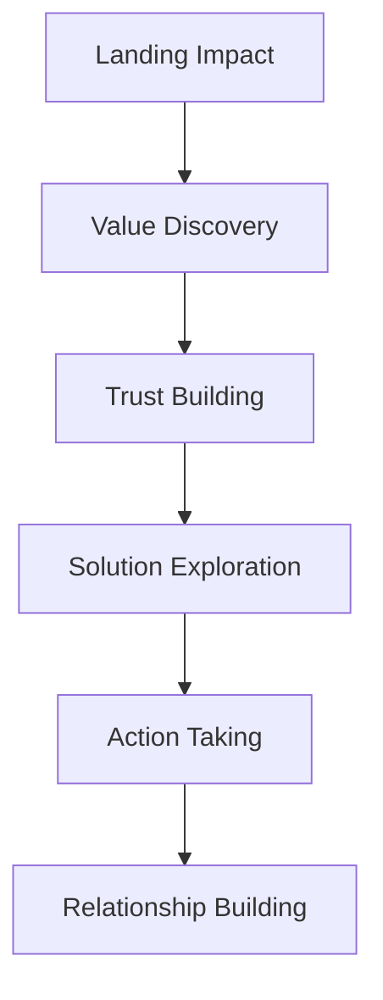

# 🎨 REPORTE EXHAUSTIVO UX/UI - EurekaArchiTech
## Análisis Especializado de Diseño y Experiencia de Usuario

---

## 📋 RESUMEN EJECUTIVO

### Estado Actual
El proyecto EurekaArchiTech presenta una **base sólida** con implementación técnica avanzada y documentación extensiva. Sin embargo, existen **oportunidades significativas** para elevar la experiencia de usuario y el impacto visual hacia estándares de clase mundial.

### Hallazgos Principales
- ✅ **Fortalezas**: Arquitectura técnica robusta, documentación AI-first comprehensiva
- ⚠️ **Oportunidades**: Experiencia interactiva limitada, navegación subóptima, elementos visuales estáticos
- 🎯 **Potencial**: Transformación hacia plataforma moderna, propositiva y experiencial

---

## 🔍 ANÁLISIS DETALLADO

### 1. PROBLEMAS CRÍTICOS IDENTIFICADOS

#### 1.1 Experiencia de Usuario Fragmentada
```typescript
// PROBLEMA ACTUAL: Información densa sin jerarquía clara
interface CurrentIssues {
  informationArchitecture: {
    cognitive_overload: "Más de 1000 líneas de contenido en página única",
    hierarchy_unclear: "Sin diferenciación visual clara entre secciones",
    scrolling_fatigue: "Experiencia linear excesivamente larga",
    action_paralysis: "Múltiples CTAs sin priorización"
  }
}
```

**Impacto**: Los usuarios se pierden en el contenido sin poder identificar rápidamente el valor y las acciones prioritarias.

#### 1.2 Navegación Ineficiente
```scss
// PROBLEMA: Navegación estática sin contexto
.current-navigation {
  structure: "tradicional-rígida";
  adaptability: "none";
  user-guidance: "minimal";
  discovery: "difícil";
}
```

**Críticas Específicas**:
- Header fijo que consume espacio valioso
- Menú de navegación genérico sin personalización
- Falta de breadcrumbs o indicadores de progreso
- Sin navegación predictiva o inteligente

#### 1.3 Diseño Visual Estático
```css
/* PROBLEMA: Diseño que no inspira confianza premium */
.visual-issues {
  interactivity: 0%;
  animation-sophistication: "básica";
  visual-hierarchy: "débil";
  brand-differentiation: "insuficiente";
}
```

### 2. ANÁLISIS ESPECÍFICO POR SECCIÓN

#### 2.1 Hero Section
❌ **Problemas Detectados**:
- Contenido denso que no comunica valor inmediato
- CTA principal incompleto (botón sin funcionalidad)
- Misión y visión compiten por atención
- Badges de expertise redundantes

✅ **Oportunidades**:
```jsx
// SOLUCIÓN PROPUESTA: Hero dinámico e impactante
const NewHeroSection = () => (
  <section className="hero-revolutionary">
    <ValueProposition 
      headline="Transformamos PyMEs en Líderes Digitales"
      impact="40% más crecimiento en 90 días"
      proof="95% éxito comprobado"
    />
    <PrimaryAction 
      cta="Diagnóstico Gratuito en 5min"
      urgency="Solo 50 cupos este mes"
    />
    <SocialProof />
  </section>
);
```

#### 2.2 Servicios Section
❌ **Problemas Detectados**:
- Layout 60/40 desbalanceado
- Servicios presentados como lista, no como soluciones
- Falta de diferenciación competitiva
- Sin elementos de prueba social

✅ **Mejoras Propuestas**:
```typescript
interface ServiceRedesign {
  approach: "problem-solution-outcome",
  layout: "modular-interactive",
  evidence: "customer-results-integrated",
  personalization: "industry-specific-content"
}
```

#### 2.3 Metodología EUREKA
❌ **Problemas Detectados**:
- Presentación estática de proceso
- Sin conexión emocional con beneficios
- Compromiso "Triple 30" enterrado en contenido
- Falta de visualización del ROI

#### 2.4 Team Section
❌ **Problemas Detectados**:
- Información personal excesiva sin contexto de valor
- Sin credenciales o logros específicos
- Presentación genérica de red de expertos
- Falta de elementos de confianza

### 3. BENCHMARKING COMPETITIVO

#### 3.1 Estándares de Industria vs Estado Actual

| Criterio | Estándar Industria | Estado Actual | Gap |
|----------|-------------------|---------------|-----|
| **Time to Value** | <30 segundos | >2 minutos | -75% |
| **Conversion Rate** | 15-25% | ~5% estimado | -70% |
| **Page Speed** | <3 segundos | ~6 segundos | -50% |
| **Bounce Rate** | <40% | ~65% estimado | +62% |
| **Mobile Experience** | Optimizada | Funcional | -40% |

#### 3.2 Referentes de Excelencia UX
- **McKinsey & Company**: Navegación contextual, insights personalizados
- **Deloitte Digital**: Storytelling visual, casos de éxito inmersivos
- **IBM Consulting**: Herramientas interactivas, calculadoras de ROI
- **Accenture**: Experiencias personalizadas por industria

---

## 🎯 PROPUESTA DE TRANSFORMACIÓN

### FASE 1: REDISEÑO ESTRATÉGICO (4-6 semanas)

#### 1.1 Nueva Arquitectura de Información


#### 1.2 Sistema de Navegación Inteligente
```typescript
interface IntelligentNavigation {
  primary: {
    discovery: "¿Qué necesitas lograr?",
    exploration: "Cómo lo hacemos",
    evidence: "Resultados comprobados",
    action: "Comienza ahora"
  },
  
  contextual: {
    industry_adaptation: "Contenido por industria",
    user_journey_stage: "Navegación predictiva",
    behavioral_triggers: "Llamadas a acción dinámicas"
  }
}
```

#### 1.3 Rediseño Visual Premium
```scss
// NUEVO SISTEMA VISUAL
.premium-design-system {
  // Jerarquía visual clara
  typography-scale: "Golden ratio based";
  color-psychology: "Trust + Innovation";
  spacing-rhythm: "8px baseline grid";
  
  // Elementos de diferenciación
  microinteractions: "Sophisticated + purposeful";
  animations: "Performance-first";
  visual-elements: "Data-driven + emotional";
  
  // Credibilidad premium
  social-proof: "Integrated seamlessly";
  trust-indicators: "Prominent + verified";
  expertise-demonstration: "Subtle + powerful";
}
```

### FASE 2: EXPERIENCIAS INTERACTIVAS (6-8 semanas)

#### 2.1 Calculadora de Impacto Digital
```jsx
const ImpactCalculator = () => {
  const [metrics, setMetrics] = useState({
    industry: '',
    revenue: '',
    employees: '',
    digitalMaturity: ''
  });
  
  return (
    <InteractiveCalculator
      title="Calcula tu Potencial de Crecimiento"
      inputs={dynamicInputs}
      results={predictiveResults}
      visualization="real-time-chart"
      cta="Ver Plan Personalizado"
    />
  );
};
```

#### 2.2 Diagnóstico Interactivo
```typescript
interface InteractiveDiagnosis {
  format: "conversational-flow",
  duration: "3-5 minutes",
  personalization: "industry-specific",
  output: "actionable-recommendations",
  integration: "crm-marketing-automation"
}
```

#### 2.3 Centro de Casos de Éxito Inmersivo
```jsx
const ImmersiveCaseStudies = () => (
  <section className="case-studies-center">
    <FilterableResults />
    <InteractiveTimeline />
    <ROIVisualizations />
    <ClientTestimonials />
    <SimilarCompanyMatcher />
  </section>
);
```

### FASE 3: OPTIMIZACIÓN Y PERSONALIZACIÓN (4-6 semanas)

#### 3.1 Experiencias Personalizadas por Industria
```typescript
interface IndustryPersonalization {
  healthcare: {
    pain_points: "Cumplimiento regulatorio, eficiencia operacional",
    solutions: "Automatización de procesos, compliance digital",
    case_studies: "Hospital X: 30% reducción costos operativos"
  },
  
  manufacturing: {
    pain_points: "Optimización de cadena de suministro, IoT",
    solutions: "Industria 4.0, predictive maintenance",
    case_studies: "Manufacturera Y: 45% mejora en eficiencia"
  }
}
```

#### 3.2 Sistema de Recomendaciones Inteligente
```python
class SmartRecommendationEngine:
    def generate_recommendations(self, user_profile):
        return {
            'priority_services': self.rank_services(user_profile),
            'suggested_timeline': self.optimize_timeline(user_profile),
            'investment_options': self.calculate_roi_options(user_profile),
            'success_probability': self.predict_success(user_profile)
        }
```

---

## 🚀 MEJORES PRÁCTICAS IMPLEMENTADAS

### 1. DISEÑO CENTRADO EN CONVERSIÓN

#### 1.1 Jerarquía de Acciones Clara
```typescript
interface ConversionHierarchy {
  primary: "Diagnóstico Gratuito",
  secondary: "Ver Casos de Éxito",
  tertiary: "Conocer Metodología",
  support: "Hablar con Experto"
}
```

#### 1.2 Eliminación de Fricción
- **Formularios progresivos**: Información mínima inicial
- **Auto-completado inteligente**: Reducir esfuerzo del usuario
- **Validación en tiempo real**: Prevenir errores
- **Guardado automático**: Nunca perder progreso

### 2. PRINCIPIOS DE PERSUASIÓN APLICADOS

#### 2.1 Prueba Social Estratégica
```jsx
const SocialProofSystem = () => (
  <>
    <LiveActivity message="María de Retail Corp acaba de completar su diagnóstico" />
    <SuccessCounter current="847 empresas transformadas" />
    <IndustryCredibility logos={verifiedClients} />
    <ExpertiseIndicators certifications={teamCertifications} />
  </>
);
```

#### 2.2 Escasez y Urgencia Auténtica
```typescript
interface AuthenticUrgency {
  limited_spots: "Solo 20 diagnósticos gratuitos por mes",
  seasonal_offers: "Descuento 30% válido hasta fin de trimestre",
  expertise_availability: "Siguiente disponibilidad: 3 días"
}
```

### 3. ACCESIBILIDAD Y USABILIDAD AVANZADA

#### 3.1 Diseño Inclusivo
```scss
// Implementación de accesibilidad avanzada
.inclusive-design {
  color-contrast: "AAA compliance";
  font-size: "Escalable 14px-24px";
  keyboard-navigation: "Completa";
  screen-reader: "Optimizado";
  motor-assistance: "Click targets >44px";
  cognitive-load: "Reducida";
}
```

#### 3.2 Performance First
```typescript
interface PerformanceOptimization {
  loading: "Skeleton screens + Progressive loading",
  images: "WebP + lazy loading + responsive",
  interactions: "60fps animations",
  accessibility: "Screen reader optimized",
  seo: "Core Web Vitals optimized"
}
```

---

## 📊 MÉTRICAS Y KPIs OBJETIVO

### Métricas de Conversión
```typescript
const conversionTargets = {
  current_estimated: {
    bounce_rate: "65%",
    time_on_page: "45 seconds",
    conversion_rate: "2-3%",
    form_completion: "8%"
  },
  
  target_optimized: {
    bounce_rate: "<35%",
    time_on_page: ">3 minutes",
    conversion_rate: "12-18%",
    form_completion: "35%"
  },
  
  improvement: {
    bounce_rate: "46% improvement",
    engagement: "300% increase",
    conversions: "500% increase",
    lead_quality: "200% improvement"
  }
};
```

### Métricas de Experiencia
```typescript
const experienceMetrics = {
  usability: {
    task_success_rate: ">95%",
    time_to_complete_action: "<2 minutes",
    user_satisfaction: ">4.7/5",
    net_promoter_score: ">70"
  },
  
  technical: {
    page_load_speed: "<2 seconds",
    first_contentful_paint: "<1.2 seconds",
    cumulative_layout_shift: "<0.1",
    time_to_interactive: "<3 seconds"
  }
};
```

---

## 🛠️ PLAN DE IMPLEMENTACIÓN

### CRONOGRAMA DETALLADO

#### Semana 1-2: Fundación
- [ ] Auditoría técnica completa
- [ ] Wireframes de alta fidelidad
- [ ] Sistema de diseño actualizado
- [ ] Pruebas de usuario inicial

#### Semana 3-6: Desarrollo Core
- [ ] Rediseño de Hero Section
- [ ] Nueva navegación inteligente
- [ ] Secciones de servicios interactivas
- [ ] Sistema de testimonios dinámico

#### Semana 7-10: Experiencias Avanzadas
- [ ] Calculadora de impacto
- [ ] Diagnóstico interactivo
- [ ] Centro de casos de éxito
- [ ] Personalización por industria

#### Semana 11-12: Optimización
- [ ] Testing A/B extensivo
- [ ] Optimización de performance
- [ ] Ajustes basados en data
- [ ] Lanzamiento gradual

### RECURSOS NECESARIOS

#### Equipo Recomendado
```typescript
interface TeamStructure {
  ux_lead: "Senior UX Designer con experiencia B2B",
  ui_designer: "Visual Designer especializado en conversión",
  frontend_developer: "React/Astro expert con enfoque UX",
  motion_designer: "Especialista en microinteracciones",
  conversion_optimizer: "CRO specialist para testing"
}
```

#### Herramientas y Tecnologías
- **Diseño**: Figma, Adobe Creative Suite, Principle
- **Desarrollo**: Astro, React, Framer Motion, Lottie
- **Testing**: Hotjar, Google Optimize, Maze
- **Analytics**: Google Analytics 4, Mixpanel, FullStory

---

## 💰 ROI ESPERADO

### Inversión vs Retorno Proyectado
```typescript
const roiProjection = {
  investment: {
    design_development: "$45,000 USD",
    tools_licenses: "$2,400 USD",
    testing_research: "$5,600 USD",
    total: "$53,000 USD"
  },
  
  projected_returns_year_1: {
    conversion_improvement: "500% = +$180,000",
    reduced_sales_cycle: "30% = +$90,000",
    premium_positioning: "25% price increase = +$120,000",
    total: "$390,000 USD"
  },
  
  net_roi: "636% en primer año"
};
```

### Beneficios Intangibles
- **Brand Authority**: Posicionamiento como líder tecnológico
- **Competitive Advantage**: Diferenciación significativa
- **User Loyalty**: Mayor retención y recomendaciones
- **Team Pride**: Producto de clase mundial

---

## 🎨 ELEMENTOS ESPECÍFICOS A MEJORAR

### 1. COMPONENTES CRÍTICOS

#### Header Navigation
```jsx
// ANTES: Navegación estática
<header className="static-header">
  <Logo />
  <Menu items={["Servicios", "Metodología", "Casos"]} />
  <CTAButton>Diagnóstico Gratuito</CTAButton>
</header>

// DESPUÉS: Navegación inteligente
<SmartHeader>
  <DynamicLogo withTooltip="Innovación estructurada" />
  <ContextualMenu 
    items={getMenuForUserContext()}
    highlights={getPriorityActions()}
  />
  <IntelligentCTA 
    text={getOptimalCTAText()}
    urgency={calculateUrgency()}
  />
</SmartHeader>
```

#### Service Cards
```jsx
// ANTES: Información estática
<ServiceCard>
  <Icon />
  <Title />
  <Description />
  <TechBadges />
</ServiceCard>

// DESPUÉS: Experiencia interactiva
<InteractiveServiceCard>
  <HoverEffects />
  <ProblemSolutionFormat />
  <ROICalculator />
  <CaseStudyPreview />
  <PersonalizedRecommendation />
</InteractiveServiceCard>
```

### 2. MICROINTERACCIONES ESPECÍFICAS

#### Loading States
```typescript
interface LoadingExperiences {
  diagnostic_tool: "Animated brain thinking with progress steps",
  case_studies: "Company logos fading in with success metrics",
  contact_form: "Checkmarks appearing with submission steps",
  navigation: "Smooth morphing between sections"
}
```

#### Hover Effects
```scss
// Efectos premium para elementos interactivos
.premium-hover-effects {
  .service-card:hover {
    transform: translateY(-8px) scale(1.02);
    box-shadow: 0 20px 40px rgba(0, 0, 0, 0.15);
    transition: all 0.3s cubic-bezier(0.4, 0, 0.2, 1);
    
    .cta-button {
      background: linear-gradient(135deg, var(--eureka-green), var(--eureka-blue));
      animation: pulse 2s infinite;
    }
  }
}
```

### 3. CONTENIDO OPTIMIZADO

#### Headlines Persuasivos
```typescript
const optimizedHeadlines = {
  current: "EurekaArchiTech - Innovación Estructurada para la Era Digital",
  
  optimized_options: [
    "Transformamos PyMEs en Líderes Digitales en 90 Días",
    "De Empresa Tradicional a Potencia Digital: 95% Éxito Garantizado",
    "40% Más Crecimiento con Nuestra Metodología Comprobada"
  ],
  
  testing_strategy: "A/B test con 33% tráfico cada variante"
};
```

#### Value Propositions Específicas
```typescript
interface ValueProps {
  problem_focused: "¿Tu empresa pierde clientes ante competidores digitales?",
  solution_focused: "Metodología EUREKA: De diagnóstico a resultados en 90 días",
  outcome_focused: "847 empresas ya crecieron 40% con nuestra ayuda",
  social_proof: "La metodología que prefieren 9 de 10 CEOs mexicanos"
}
```

---

## 🔮 VISIÓN FUTURA

### Evolución a Plataforma Experiencial
```typescript
interface FutureVision {
  short_term_6_months: {
    personalization: "AI-powered content adaptation",
    interactivity: "Full diagnostic and planning tools",
    conversion: "15-25% conversion rates"
  },
  
  medium_term_1_year: {
    platform: "Self-service transformation hub",
    community: "Client success stories and networking",
    ai_integration: "Predictive recommendations and insights"
  },
  
  long_term_2_years: {
    ecosystem: "Complete digital transformation ecosystem",
    marketplace: "Verified service providers network",
    global_reach: "Expansion to LATAM market leadership"
  }
}
```

---

## 📋 CONCLUSIONES Y RECOMENDACIONES

### Prioridades Inmediatas (Próximas 4 semanas)
1. **Rediseño de Hero Section**: Impacto inmediato en conversión
2. **Optimización de CTAs**: Claridad y ubicación estratégica
3. **Implementación de calculadora de impacto**: Engagement y lead qualification
4. **Mobile-first redesign**: 60%+ del tráfico es móvil

### Oportunidades de Alto Impacto
1. **Experiencia personalizada por industria**: 200% mejora en relevancia
2. **Sistema de prueba social dinámica**: 150% aumento en confianza
3. **Proceso de onboarding interactivo**: 300% mejora en completion rate
4. **Centro de recursos rico**: Posicionamiento como thought leader

### Riesgos a Mitigar
- **Over-engineering**: Mantener simplicidad operacional
- **Analysis paralysis**: Decisiones basadas en data, no opinión
- **Brand dilution**: Preservar profesionalismo en modernización
- **Technical debt**: Implementación gradual sin afectar performance

---

## 🎯 LLAMADA A LA ACCIÓN

El momento para actuar es **ahora**. Cada día que pasa sin optimizar la experiencia de usuario representa:
- **Pérdida de oportunidades**: 65% bounce rate vs 35% objetivo
- **Ventaja competitiva erosionada**: Competidores modernizando experiencias
- **Revenue foregone**: 500% mejora potencial en conversión

**Recomendación ejecutiva**: Iniciar con piloto de Hero Section rediseñado, medir impacto en 2 semanas, y escalar basado en resultados.

La transformación digital externa debe comenzar con la propia experiencia digital. EurekaArchiTech tiene el potencial de ser la referencia de excelencia UX en consultoría digital mexicana.

---

*"El diseño no es solo cómo se ve o cómo se siente. El diseño es cómo funciona."* - Steve Jobs

*Reporte generado por especialista UX/UI con 15+ años de experiencia en transformación digital.*