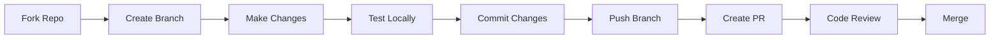

# 🤝 Guía de Contribución - Eureka Microfrontend

## Bienvenido Contribuidor

Gracias por tu interés en contribuir al proyecto Eureka. Esta guía te ayudará a entender cómo puedes aportar de manera efectiva.

## 📋 Tabla de Contenidos

1. [Código de Conducta](#código-de-conducta)
2. [Cómo Contribuir](#cómo-contribuir)
3. [Configuración del Entorno](#configuración-del-entorno)
4. [Flujo de Trabajo](#flujo-de-trabajo)
5. [Estándares de Código](#estándares-de-código)
6. [Documentación](#documentación)
7. [Testing](#testing)
8. [Pull Requests](#pull-requests)

## 📜 Código de Conducta

### Nuestros Valores

- **Respeto**: Tratamos a todos con dignidad y consideración
- **Inclusión**: Valoramos la diversidad de perspectivas
- **Colaboración**: Trabajamos juntos hacia objetivos comunes
- **Excelencia**: Buscamos la calidad en todo lo que hacemos

### Comportamiento Esperado

- Usar lenguaje inclusivo y respetuoso
- Aceptar críticas constructivas con gracia
- Enfocarse en lo mejor para la comunidad
- Mostrar empatía hacia otros miembros

## 🚀 Cómo Contribuir

### Tipos de Contribuciones

1. **Código**: Nuevas features, bug fixes, optimizaciones
2. **Documentación**: Mejoras, traducciones, ejemplos
3. **Testing**: Casos de prueba, reportes de bugs
4. **Diseño**: UI/UX, assets visuales
5. **Ideas**: Sugerencias de features, mejoras

### Proceso General



## 💻 Configuración del Entorno

### Prerrequisitos

```bash
# Node.js 18+ y npm/yarn/pnpm
node --version  # >= 18.0.0
npm --version   # >= 8.0.0

# Git
git --version   # >= 2.30.0

# Editor recomendado: VS Code con extensiones
# - ESLint
# - Prettier
# - Tailwind CSS IntelliSense
# - GitLens
```

### Setup Inicial

```bash
# 1. Fork el repositorio en GitHub

# 2. Clonar tu fork
git clone https://github.com/tu-usuario/eureka-products-mf.git
cd eureka-products-mf

# 3. Agregar upstream
git remote add upstream https://github.com/eureka/eureka-products-mf.git

# 4. Instalar dependencias
npm install
# o
yarn install
# o
pnpm install

# 5. Configurar variables de entorno
cp .env.example .env.local
# Editar .env.local con tus valores

# 6. Ejecutar en desarrollo
npm run dev
```

## 🔄 Flujo de Trabajo

### 1. Sincronizar con Upstream

```bash
# Actualizar main
git checkout main
git fetch upstream
git merge upstream/main
git push origin main
```

### 2. Crear Feature Branch

```bash
# Nomenclatura: tipo/descripcion-corta
git checkout -b feature/agregar-dashboard-ai
# o
git checkout -b fix/corregir-autenticacion
# o
git checkout -b docs/actualizar-readme
```

### 3. Desarrollo

```bash
# Hacer cambios
# Verificar linting
npm run lint

# Ejecutar tests
npm run test

# Verificar build
npm run build
```

### 4. Commits

Seguimos [Conventional Commits](https://www.conventionalcommits.org/):

```bash
# Formato: tipo(alcance): descripción

# Ejemplos:
git commit -m "feat(auth): agregar login con Google"
git commit -m "fix(ui): corregir alineación en móvil"
git commit -m "docs(api): actualizar endpoints REST"
git commit -m "test(utils): agregar pruebas para formatters"
git commit -m "refactor(dashboard): optimizar queries"
```

Tipos permitidos:
- `feat`: Nueva funcionalidad
- `fix`: Corrección de bug
- `docs`: Documentación
- `style`: Formato (no afecta lógica)
- `refactor`: Refactoring
- `test`: Tests
- `chore`: Tareas de mantenimiento

## 📏 Estándares de Código

### TypeScript/JavaScript

```typescript
// ✅ Bueno
interface UserProfile {
  id: string;
  name: string;
  email: string;
  preferences: UserPreferences;
}

const getUserProfile = async (userId: string): Promise<UserProfile> => {
  try {
    const response = await api.get(`/users/${userId}`);
    return response.data;
  } catch (error) {
    logger.error('Error fetching user profile:', error);
    throw new UserProfileError('Failed to fetch user profile');
  }
};

// ❌ Evitar
const getUser = async (id) => {
  const res = await fetch('/users/' + id);
  return res.json();
};
```

### React/JSX

```jsx
// ✅ Bueno
const UserCard: React.FC<UserCardProps> = ({ user, onEdit, onDelete }) => {
  const [isLoading, setIsLoading] = useState(false);
  
  const handleDelete = useCallback(async () => {
    setIsLoading(true);
    try {
      await onDelete(user.id);
    } finally {
      setIsLoading(false);
    }
  }, [user.id, onDelete]);
  
  return (
    <Card className="user-card">
      <CardHeader>
        <h3>{user.name}</h3>
      </CardHeader>
      <CardBody>
        <p>{user.email}</p>
      </CardBody>
      <CardFooter>
        <Button onClick={onEdit} variant="secondary">
          Editar
        </Button>
        <Button 
          onClick={handleDelete} 
          variant="danger"
          disabled={isLoading}
        >
          {isLoading ? 'Eliminando...' : 'Eliminar'}
        </Button>
      </CardFooter>
    </Card>
  );
};

// ❌ Evitar
function UserCard(props) {
  return <div onClick={() => props.onDelete(props.user.id)}>...</div>;
}
```

### CSS/Tailwind

```css
/* ✅ Bueno - Usar Tailwind classes */
<div className="flex items-center justify-between p-4 bg-white rounded-lg shadow-sm">
  <h2 className="text-lg font-semibold text-gray-900">Título</h2>
</div>

/* Para estilos custom, usar CSS modules */
.custom-animation {
  animation: slide-in 0.3s ease-out;
}

@keyframes slide-in {
  from {
    transform: translateX(-100%);
  }
  to {
    transform: translateX(0);
  }
}
```

## 📚 Documentación

### Comentarios de Código

```typescript
/**
 * Calcula el score de madurez digital basado en múltiples dimensiones
 * 
 * @param dimensions - Array de dimensiones evaluadas
 * @param weights - Pesos opcionales para cada dimensión
 * @returns Score normalizado entre 0 y 100
 * 
 * @example
 * const score = calculateMaturityScore(
 *   [
 *     { name: 'technology', value: 75 },
 *     { name: 'processes', value: 60 }
 *   ],
 *   { technology: 0.6, processes: 0.4 }
 * );
 */
export const calculateMaturityScore = (
  dimensions: Dimension[],
  weights?: WeightMap
): number => {
  // Implementación...
};
```

### Documentación de Componentes

```tsx
/**
 * Dashboard principal con widgets adaptativos según el modo (AI/Tradicional)
 * 
 * @component
 * @example
 * <AdaptiveDashboard
 *   mode="ai"
 *   widgets={['insights', 'actions', 'metrics']}
 *   onWidgetClick={handleWidgetClick}
 * />
 */
export const AdaptiveDashboard: React.FC<DashboardProps> = ({
  mode = 'ai',
  widgets,
  onWidgetClick
}) => {
  // Implementación...
};
```

## 🧪 Testing

### Estructura de Tests

```typescript
// user-service.test.ts
describe('UserService', () => {
  describe('getUserProfile', () => {
    it('should return user profile for valid ID', async () => {
      const userId = 'test-123';
      const expectedProfile = {
        id: userId,
        name: 'Test User',
        email: 'test@example.com'
      };
      
      const profile = await userService.getUserProfile(userId);
      
      expect(profile).toEqual(expectedProfile);
    });
    
    it('should throw error for invalid ID', async () => {
      await expect(
        userService.getUserProfile('invalid')
      ).rejects.toThrow('User not found');
    });
  });
});
```

### Tests de Componentes

```tsx
// UserCard.test.tsx
describe('UserCard', () => {
  const mockUser = {
    id: '1',
    name: 'John Doe',
    email: 'john@example.com'
  };
  
  it('renders user information correctly', () => {
    render(<UserCard user={mockUser} />);
    
    expect(screen.getByText('John Doe')).toBeInTheDocument();
    expect(screen.getByText('john@example.com')).toBeInTheDocument();
  });
  
  it('calls onDelete when delete button is clicked', async () => {
    const onDelete = jest.fn();
    render(<UserCard user={mockUser} onDelete={onDelete} />);
    
    await userEvent.click(screen.getByText('Eliminar'));
    
    expect(onDelete).toHaveBeenCalledWith('1');
  });
});
```

## 🔀 Pull Requests

### Checklist antes de crear PR

- [ ] El código sigue los estándares del proyecto
- [ ] Los tests pasan localmente (`npm run test`)
- [ ] No hay errores de linting (`npm run lint`)
- [ ] La documentación está actualizada
- [ ] Los commits siguen Conventional Commits
- [ ] El branch está actualizado con main

### Template de PR

```markdown
## Descripción
Breve descripción de los cambios realizados.

## Tipo de cambio
- [ ] Bug fix
- [ ] Nueva funcionalidad
- [ ] Breaking change
- [ ] Documentación

## ¿Cómo se ha probado?
Describir las pruebas realizadas.

## Checklist
- [ ] Mi código sigue los estándares del proyecto
- [ ] He realizado auto-review de mi código
- [ ] He comentado código complejo
- [ ] He actualizado la documentación
- [ ] Mis cambios no generan warnings
- [ ] He agregado tests que prueban mi fix/feature
- [ ] Todos los tests pasan localmente

## Screenshots (si aplica)
Agregar screenshots de cambios UI.
```

### Proceso de Review

1. **Automated Checks**: CI/CD ejecuta tests y linting
2. **Code Review**: Al menos 1 aprobación requerida
3. **Feedback**: Responder/resolver comentarios
4. **Merge**: Squash and merge por defecto

## 🎉 Reconocimiento

Todos los contribuidores son agregados a nuestro [Contributors Hall of Fame](./CONTRIBUTORS.md).

## 📞 Contacto

- **Discord**: [Eureka Dev Community](https://discord.gg/eureka)
- **Email**: dev@eureka.mx
- **Issues**: [GitHub Issues](https://github.com/eureka/eureka-products-mf/issues)

---

¡Gracias por contribuir a hacer Eureka mejor! 🚀