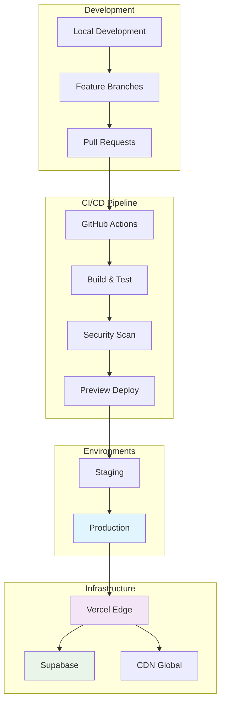

# EurekaArchiTech - Deployment Guide

## 📋 Información General

Esta guía proporciona instrucciones detalladas para el deployment del sitio web oficial de EurekaArchiTech, incluyendo configuración de entornos, CI/CD, monitoreo y troubleshooting.

| Atributo | Valor |
|----------|-------|
| **Plataforma Principal** | Vercel |
| **Framework** | Astro 4.16+ |
| **Runtime** | Node.js 18+ |
| **Database** | Supabase PostgreSQL |
| **CDN** | Vercel Edge Network |
| **Dominio** | eureka-architech.com |

---

## 🏗️ Arquitectura de Deployment



---

## 🚀 Configuración Inicial

### 1. Prerequisites

```bash
# Node.js 18+
node --version  # v18.18.0+
npm --version   # 9.0.0+

# Git
git --version  # 2.30+

# Vercel CLI (opcional)
npm install -g vercel
```

### 2. Environment Setup

#### Variables de Entorno Requeridas

```bash
# .env.local (development)
NODE_ENV=development
SITE_URL=http://localhost:4321

# Supabase
SUPABASE_URL=https://your-project.supabase.co
SUPABASE_ANON_KEY=your_anon_key
SUPABASE_SERVICE_ROLE_KEY=your_service_role_key

# OpenAI (para funciones AI)
OPENAI_API_KEY=your_openai_api_key
OPENAI_ORG_ID=your_organization_id

# Analytics
VERCEL_ANALYTICS_ID=your_analytics_id

# Monitoring
SENTRY_DSN=your_sentry_dsn
SENTRY_ORG=eureka-architech
SENTRY_PROJECT=website

# Feature Flags
ENABLE_AI_FEATURES=true
ENABLE_ANALYTICS=true
ENABLE_CHATBOT=false  # development default
```

#### Variables de Producción

```bash
# Production environment variables
NODE_ENV=production
SITE_URL=https://eureka-architech.com

# Security
NEXTAUTH_SECRET=your_super_secure_secret
NEXTAUTH_URL=https://eureka-architech.com

# External Services
RESEND_API_KEY=your_resend_key  # para emails
STRIPE_SECRET_KEY=your_stripe_key  # si usamos pagos

# Performance Monitoring
NEW_RELIC_LICENSE_KEY=your_newrelic_key  # opcional
```

---

## 🔧 Configuración de Vercel

### 1. Vercel Project Setup

```bash
# Conectar proyecto con Vercel
vercel login
vercel link

# Configurar environment variables
vercel env add SUPABASE_URL
vercel env add SUPABASE_ANON_KEY
vercel env add OPENAI_API_KEY
# ... (agregar todas las variables necesarias)
```

### 2. vercel.json Configuration

```json
{
  "buildCommand": "npm run build",
  "outputDirectory": "dist",
  "installCommand": "npm ci",
  "framework": "astro",
  "functions": {
    "app/api/**/*.ts": {
      "runtime": "@vercel/node",
      "maxDuration": 30
    }
  },
  "rewrites": [
    {
      "source": "/api/(.*)",
      "destination": "/api/$1"
    }
  ],
  "headers": [
    {
      "source": "/(.*)",
      "headers": [
        {
          "key": "X-Frame-Options",
          "value": "DENY"
        },
        {
          "key": "X-Content-Type-Options",
          "value": "nosniff"
        },
        {
          "key": "Referrer-Policy",
          "value": "strict-origin-when-cross-origin"
        },
        {
          "key": "Permissions-Policy",
          "value": "camera=(), microphone=(), geolocation=()"
        }
      ]
    },
    {
      "source": "/api/(.*)",
      "headers": [
        {
          "key": "Access-Control-Allow-Origin",
          "value": "https://eureka-architech.com"
        },
        {
          "key": "Access-Control-Allow-Methods",
          "value": "GET, POST, PUT, DELETE, OPTIONS"
        },
        {
          "key": "Access-Control-Allow-Headers",
          "value": "Content-Type, Authorization"
        }
      ]
    }
  ],
  "redirects": [
    {
      "source": "/home",
      "destination": "/",
      "permanent": true
    },
    {
      "source": "/contact",
      "destination": "/contacto",
      "permanent": true
    }
  ]
}
```

### 3. Domain Configuration

```bash
# Agregar dominio personalizado
vercel domains add eureka-architech.com
vercel domains add www.eureka-architech.com

# Verificar configuración DNS
vercel domains ls
```

---

## 🔄 CI/CD Pipeline

### 1. GitHub Actions Workflow

```yaml
# .github/workflows/ci-cd.yml
name: CI/CD Pipeline

on:
  push:
    branches: [main, develop]
  pull_request:
    branches: [main]

env:
  NODE_VERSION: '18'
  VERCEL_ORG_ID: ${{ secrets.VERCEL_ORG_ID }}
  VERCEL_PROJECT_ID: ${{ secrets.VERCEL_PROJECT_ID }}

jobs:
  lint-and-test:
    runs-on: ubuntu-latest
    steps:
      - name: Checkout code
        uses: actions/checkout@v4

      - name: Setup Node.js
        uses: actions/setup-node@v4
        with:
          node-version: ${{ env.NODE_VERSION }}
          cache: 'npm'

      - name: Install dependencies
        run: npm ci

      - name: Run linter
        run: npm run lint

      - name: Type check
        run: npm run typecheck

      - name: Run tests
        run: npm run test

      - name: Build project
        run: npm run build

  security-scan:
    runs-on: ubuntu-latest
    needs: lint-and-test
    steps:
      - name: Checkout code
        uses: actions/checkout@v4

      - name: Run Snyk security scan
        uses: snyk/actions/node@master
        env:
          SNYK_TOKEN: ${{ secrets.SNYK_TOKEN }}

      - name: Audit dependencies
        run: npm audit --audit-level=high

  deploy-preview:
    if: github.event_name == 'pull_request'
    runs-on: ubuntu-latest
    needs: [lint-and-test, security-scan]
    steps:
      - name: Checkout code
        uses: actions/checkout@v4

      - name: Install Vercel CLI
        run: npm install --global vercel@latest

      - name: Pull Vercel environment
        run: vercel pull --yes --environment=preview --token=${{ secrets.VERCEL_TOKEN }}

      - name: Build project
        run: vercel build --token=${{ secrets.VERCEL_TOKEN }}

      - name: Deploy to Vercel
        id: deploy
        run: echo "url=$(vercel deploy --prebuilt --token=${{ secrets.VERCEL_TOKEN }})" >> $GITHUB_OUTPUT

      - name: Comment PR with preview URL
        uses: actions/github-script@v7
        with:
          script: |
            github.rest.issues.createComment({
              issue_number: context.issue.number,
              owner: context.repo.owner,
              repo: context.repo.repo,
              body: '🚀 Preview deployment: ${{ steps.deploy.outputs.url }}'
            })

  deploy-production:
    if: github.ref == 'refs/heads/main'
    runs-on: ubuntu-latest
    needs: [lint-and-test, security-scan]
    environment: production
    steps:
      - name: Checkout code
        uses: actions/checkout@v4

      - name: Install Vercel CLI
        run: npm install --global vercel@latest

      - name: Pull Vercel environment
        run: vercel pull --yes --environment=production --token=${{ secrets.VERCEL_TOKEN }}

      - name: Build project
        run: vercel build --prod --token=${{ secrets.VERCEL_TOKEN }}

      - name: Deploy to production
        run: vercel deploy --prebuilt --prod --token=${{ secrets.VERCEL_TOKEN }}

  lighthouse-audit:
    if: github.ref == 'refs/heads/main'
    runs-on: ubuntu-latest
    needs: deploy-production
    steps:
      - name: Checkout code
        uses: actions/checkout@v4

      - name: Run Lighthouse CI
        uses: treosh/lighthouse-ci-action@v10
        with:
          configPath: '.lighthouserc.json'
          uploadArtifacts: true
          temporaryPublicStorage: true
```

### 2. Lighthouse CI Configuration

```json
{
  "ci": {
    "collect": {
      "url": [
        "https://eureka-architech.com",
        "https://eureka-architech.com/servicios",
        "https://eureka-architech.com/nosotros",
        "https://eureka-architech.com/contacto"
      ],
      "numberOfRuns": 3
    },
    "assert": {
      "assertions": {
        "categories:performance": ["error", {"minScore": 0.95}],
        "categories:accessibility": ["error", {"minScore": 1.0}],
        "categories:best-practices": ["error", {"minScore": 1.0}],
        "categories:seo": ["error", {"minScore": 1.0}]
      }
    },
    "upload": {
      "target": "temporary-public-storage"
    }
  }
}
```

---

## 🗄️ Database Setup (Supabase)

### 1. Initial Schema

```sql
-- Create profiles table
CREATE TABLE IF NOT EXISTS public.profiles (
    id UUID REFERENCES auth.users(id) ON DELETE CASCADE,
    email TEXT UNIQUE NOT NULL,
    first_name TEXT,
    last_name TEXT,
    company TEXT,
    phone TEXT,
    created_at TIMESTAMP WITH TIME ZONE DEFAULT NOW(),
    updated_at TIMESTAMP WITH TIME ZONE DEFAULT NOW(),
    PRIMARY KEY (id)
);

-- Create leads table
CREATE TABLE IF NOT EXISTS public.leads (
    id UUID DEFAULT gen_random_uuid() PRIMARY KEY,
    email TEXT NOT NULL,
    first_name TEXT NOT NULL,
    last_name TEXT NOT NULL,
    company TEXT NOT NULL,
    phone TEXT,
    message TEXT NOT NULL,
    service_interest TEXT[],
    budget_range TEXT,
    timeline TEXT,
    source TEXT DEFAULT 'website',
    status TEXT DEFAULT 'new',
    lead_score INTEGER DEFAULT 0,
    metadata JSONB DEFAULT '{}',
    created_at TIMESTAMP WITH TIME ZONE DEFAULT NOW(),
    updated_at TIMESTAMP WITH TIME ZONE DEFAULT NOW()
);

-- Create newsletter_subscribers table
CREATE TABLE IF NOT EXISTS public.newsletter_subscribers (
    id UUID DEFAULT gen_random_uuid() PRIMARY KEY,
    email TEXT UNIQUE NOT NULL,
    first_name TEXT,
    interests TEXT[],
    status TEXT DEFAULT 'pending',
    source TEXT DEFAULT 'website',
    subscribed_at TIMESTAMP WITH TIME ZONE DEFAULT NOW(),
    confirmed_at TIMESTAMP WITH TIME ZONE,
    unsubscribed_at TIMESTAMP WITH TIME ZONE
);

-- Enable Row Level Security
ALTER TABLE public.profiles ENABLE ROW LEVEL SECURITY;
ALTER TABLE public.leads ENABLE ROW LEVEL SECURITY;
ALTER TABLE public.newsletter_subscribers ENABLE ROW LEVEL SECURITY;

-- Create policies
CREATE POLICY "Users can view their own profile" ON public.profiles
    FOR SELECT USING (auth.uid() = id);

CREATE POLICY "Users can update their own profile" ON public.profiles
    FOR UPDATE USING (auth.uid() = id);

-- Indexes for performance
CREATE INDEX IF NOT EXISTS idx_leads_email ON public.leads(email);
CREATE INDEX IF NOT EXISTS idx_leads_status ON public.leads(status);
CREATE INDEX IF NOT EXISTS idx_leads_created_at ON public.leads(created_at);
CREATE INDEX IF NOT EXISTS idx_newsletter_email ON public.newsletter_subscribers(email);
CREATE INDEX IF NOT EXISTS idx_newsletter_status ON public.newsletter_subscribers(status);
```

### 2. Environment-specific Configurations

```sql
-- Production: Enable additional security
ALTER DATABASE postgres SET log_statement = 'all';
ALTER DATABASE postgres SET log_duration = on;

-- Performance optimizations
ALTER SYSTEM SET shared_preload_libraries = 'pg_stat_statements';
ALTER SYSTEM SET track_activity_query_size = 2048;
ALTER SYSTEM SET pg_stat_statements.track = all;
```

---

## 📊 Monitoring & Analytics

### 1. Error Tracking (Sentry)

```typescript
// src/lib/sentry.ts
import * as Sentry from "@sentry/astro";

Sentry.init({
  dsn: import.meta.env.SENTRY_DSN,
  environment: import.meta.env.NODE_ENV,
  tracesSampleRate: import.meta.env.NODE_ENV === 'production' ? 0.1 : 1.0,
  beforeSend(event) {
    // Filter out known non-critical errors
    if (event.exception) {
      const error = event.exception.values?.[0];
      if (error?.type === 'ChunkLoadError') {
        return null; // Don't send chunk load errors
      }
    }
    return event;
  },
  integrations: [
    new Sentry.BrowserTracing({
      // Set sampling rate for performance monitoring
      tracingOrigins: ["eureka-architech.com", /^\//],
    }),
  ],
});
```

### 2. Performance Monitoring

```typescript
// src/lib/analytics.ts
import { Analytics } from '@vercel/analytics/react';
import { onCLS, onFID, onFCP, onLCP, onTTFB } from 'web-vitals';

// Web Vitals tracking
function sendToAnalytics(metric: any) {
  // Send to Vercel Analytics
  if (typeof window !== 'undefined' && window.va) {
    window.va('track', 'Web Vital', {
      name: metric.name,
      value: metric.value,
      rating: metric.rating,
      delta: metric.delta,
      id: metric.id,
    });
  }

  // Send to custom analytics if needed
  fetch('/api/analytics/web-vitals', {
    method: 'POST',
    headers: { 'Content-Type': 'application/json' },
    body: JSON.stringify({
      name: metric.name,
      value: metric.value,
      page: window.location.pathname,
      timestamp: Date.now(),
    }),
  });
}

// Initialize monitoring
export function initPerformanceMonitoring() {
  onCLS(sendToAnalytics);
  onFID(sendToAnalytics);
  onFCP(sendToAnalytics);
  onLCP(sendToAnalytics);
  onTTFB(sendToAnalytics);
}
```

### 3. Custom Dashboards

```bash
# Vercel Analytics API examples
curl -H "Authorization: Bearer $VERCEL_TOKEN" \
     "https://api.vercel.com/v1/analytics/eureka-architech-site"

# Supabase Analytics
curl -H "Authorization: Bearer $SUPABASE_SERVICE_ROLE_KEY" \
     "https://your-project.supabase.co/rest/v1/analytics_events"
```

---

## 🛡️ Security Configuration

### 1. Content Security Policy

```typescript
// astro.config.mjs
export default defineConfig({
  security: {
    contentSecurityPolicy: {
      'default-src': ["'self'"],
      'script-src': [
        "'self'",
        "'unsafe-inline'", // Required for Astro
        "https://vercel.live",
        "https://va.vercel-scripts.com"
      ],
      'style-src': [
        "'self'",
        "'unsafe-inline'",
        "https://fonts.googleapis.com"
      ],
      'font-src': [
        "'self'",
        "https://fonts.gstatic.com"
      ],
      'img-src': [
        "'self'",
        "data:",
        "https:",
        "blob:"
      ],
      'connect-src': [
        "'self'",
        "https://*.supabase.co",
        "https://api.openai.com",
        "https://vitals.vercel-insights.com"
      ],
    }
  }
});
```

### 2. Rate Limiting

```typescript
// middleware/rate-limit.ts
import { Ratelimit } from "@upstash/ratelimit";
import { Redis } from "@upstash/redis";

const redis = new Redis({
  url: process.env.UPSTASH_REDIS_REST_URL!,
  token: process.env.UPSTASH_REDIS_REST_TOKEN!,
});

export const ratelimit = new Ratelimit({
  redis,
  limiter: Ratelimit.slidingWindow(100, "1 m"), // 100 requests per minute
  analytics: true,
});

export async function rateLimitMiddleware(request: Request) {
  const ip = request.headers.get("x-forwarded-for") ?? "127.0.0.1";
  const { success, limit, reset, remaining } = await ratelimit.limit(ip);

  if (!success) {
    return new Response("Rate limit exceeded", {
      status: 429,
      headers: {
        "X-RateLimit-Limit": limit.toString(),
        "X-RateLimit-Remaining": remaining.toString(),
        "X-RateLimit-Reset": new Date(reset).toISOString(),
      },
    });
  }

  return null; // Continue processing
}
```

---

## 🚨 Incident Response

### 1. Monitoring Alerts

```yaml
# .github/workflows/monitoring.yml
name: Website Monitoring

on:
  schedule:
    - cron: '*/5 * * * *'  # Every 5 minutes

jobs:
  uptime-check:
    runs-on: ubuntu-latest
    steps:
      - name: Check website status
        run: |
          response=$(curl -s -o /dev/null -w "%{http_code}" https://eureka-architech.com)
          if [ $response -ne 200 ]; then
            echo "Website is down! Status code: $response"
            # Send alert to Slack/Discord
            curl -X POST -H 'Content-type: application/json' \
              --data '{"text":"🚨 EurekaArchiTech website is down! Status: '$response'"}' \
              ${{ secrets.SLACK_WEBHOOK_URL }}
            exit 1
          fi
          echo "Website is up! Status code: $response"

  performance-check:
    runs-on: ubuntu-latest
    steps:
      - name: Lighthouse CI check
        run: |
          npm install -g @lhci/cli
          lhci autorun --config=.lighthouserc.json
```

### 2. Backup Procedures

```bash
#!/bin/bash
# backup.sh - Database backup script

# Backup Supabase database
pg_dump "$SUPABASE_DB_URL" > "backup_$(date +%Y%m%d_%H%M%S).sql"

# Upload to cloud storage
aws s3 cp backup_*.sql s3://eureka-backups/database/

# Keep only last 30 days of backups
find . -name "backup_*.sql" -mtime +30 -delete

# Verify backup integrity
if [ $? -eq 0 ]; then
    echo "✅ Backup completed successfully"
else
    echo "❌ Backup failed"
    # Send alert
    curl -X POST -H 'Content-type: application/json' \
      --data '{"text":"🚨 Database backup failed!"}' \
      $SLACK_WEBHOOK_URL
fi
```

---

## 🔧 Troubleshooting

### Common Issues

#### 1. Build Failures

```bash
# Clear all caches
rm -rf node_modules .astro dist .vercel
npm ci
npm run build

# Check for TypeScript errors
npm run typecheck

# Verify Astro configuration
npx astro check --verbose
```

#### 2. Performance Issues

```bash
# Analyze bundle size
npm run build
npx astro build --analyze

# Check for memory leaks
node --inspect --max-old-space-size=4096 npm run build

# Profile build performance
DEBUG=astro:build npm run build
```

#### 3. Deployment Issues

```bash
# Check Vercel deployment logs
vercel logs

# Verify environment variables
vercel env ls

# Test production build locally
npm run build && npm run preview

# Check domain configuration
vercel domains ls
```

#### 4. Database Connection Issues

```sql
-- Check active connections
SELECT count(*) FROM pg_stat_activity;

-- Check slow queries
SELECT query, mean_exec_time, calls 
FROM pg_stat_statements 
ORDER BY mean_exec_time DESC 
LIMIT 10;

-- Check table sizes
SELECT schemaname, tablename, 
       pg_size_pretty(pg_total_relation_size(schemaname||'.'||tablename)) as size
FROM pg_tables 
ORDER BY pg_total_relation_size(schemaname||'.'||tablename) DESC;
```

### Performance Debugging

```typescript
// Debug performance issues
function debugPerformance() {
  // Check Core Web Vitals
  import('web-vitals').then(({ getCLS, getFID, getFCP, getLCP, getTTFB }) => {
    getCLS(console.log);
    getFID(console.log);
    getFCP(console.log);
    getLCP(console.log);
    getTTFB(console.log);
  });

  // Check resource loading
  const observer = new PerformanceObserver((list) => {
    list.getEntries().forEach((entry) => {
      if (entry.duration > 100) {
        console.warn('Slow resource:', entry.name, entry.duration);
      }
    });
  });
  observer.observe({ entryTypes: ['resource'] });
}
```

---

## 📋 Deployment Checklist

### Pre-deployment

- [ ] All tests passing
- [ ] TypeScript compilation successful
- [ ] Linting issues resolved
- [ ] Security scan passed
- [ ] Environment variables configured
- [ ] Database migrations applied
- [ ] Performance benchmarks met

### Post-deployment

- [ ] Website accessibility verified
- [ ] All pages loading correctly
- [ ] Forms submitting successfully
- [ ] Analytics tracking working
- [ ] Error monitoring active
- [ ] Performance metrics within targets
- [ ] SSL certificate valid
- [ ] CDN cache warming completed

### Rollback Plan

```bash
# Emergency rollback procedure
vercel rollback --timeout=30s

# Verify rollback success
curl -I https://eureka-architech.com

# Check error rates
curl -H "Authorization: Bearer $SENTRY_TOKEN" \
     "https://sentry.io/api/0/organizations/eureka-architech/events/"
```

---

## 📞 Support Contacts

### Production Issues (24/7)

- **On-call Engineer**: +52 55 XXXX-XXXX
- **Slack**: #alerts-production
- **Email**: alerts@eureka-architech.com

### Business Hours Support

- **Technical Lead**: oscar@eureka-architech.com
- **DevOps**: devops@eureka-architech.com
- **Business Contact**: hi@eureka-architech.com

### Escalation Matrix

| Severity | Response Time | Escalation |
|----------|--------------|------------|
| **P0** (Site Down) | 15 minutes | Tech Lead + CTO |
| **P1** (Critical Feature) | 1 hour | Tech Lead |
| **P2** (Performance) | 4 hours | Assigned Developer |
| **P3** (Minor Bug) | 24 hours | Next Sprint |

---

*Última actualización: Enero 2025*  
*Versión: 1.0*  
*Mantenido por: EurekaArchiTech DevOps Team*