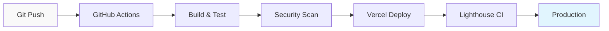

# EurekaArchiTech - Especificación Técnica

## 📋 Información del Proyecto

| Atributo | Valor |
|----------|-------|
| **Proyecto** | EurekaArchiTech Sitio Web Oficial |
| **Versión** | 2.0.0 |
| **Estado** | Producción |
| **URL** | https://eureka-architech.com |
| **Repositorio** | https://github.com/osvalois/eureka-architech-site |
| **Última Actualización** | Enero 2025 |

---

## 🏗️ Arquitectura del Sistema

### Arquitectura General

```mermaid
graph TB
    subgraph "Frontend Layer"
        A[Astro 4.16+ SSG]
        B[React Islands]
        C[TypeScript]
        D[Tailwind CSS]
    end
    
    subgraph "Infrastructure Layer"
        E[Vercel Edge Network]
        F[Global CDN]
        G[Edge Functions]
    end
    
    subgraph "Backend Services"
        H[Supabase BaaS]
        I[PostgreSQL + pgvector]
        J[Authentication]
        K[Real-time subscriptions]
    end
    
    subgraph "AI/ML Layer"
        L[OpenAI GPT-4]
        M[Vector Embeddings]
        N[Semantic Search]
    end
    
    A --> E
    B --> G
    H --> I
    L --> M
    E --> F
    
    style A fill:#FF5D01
    style H fill:#3ECF8E
    style L fill:#10A37F
    style E fill:#000000
```



### Principios Arquitectónicos

1. **Islands Architecture** - JavaScript selectivo, HTML-first
2. **Edge-First** - Deploy global con latencia mínima
3. **Progressive Enhancement** - Funcionalidad base sin JavaScript
4. **Mobile-First** - Diseño responsive desde móvil
5. **Performance Budget** - <5KB JS crítico, <1s LCP

---

## 🛠️ Stack Tecnológico Detallado

### Frontend Core

```typescript
interface FrontendStack {
  framework: "Astro 4.16+";
  language: "TypeScript 5.6+";
  styling: "Tailwind CSS 3.4+";
  components: "Astro Components + React Islands";
  buildTool: "Vite";
  bundler: "Rollup";
}
```

#### Justificación de Astro
- **SSG por defecto**: HTML estático para máximo rendimiento
- **Islands Architecture**: JavaScript solo donde se necesita
- **Multi-framework**: Compatibilidad con React, Vue, Svelte
- **SEO Optimizado**: Rendering estático ideal para buscadores
- **Developer Experience**: Hot reload instantáneo, TypeScript nativo

### Backend & Database

```typescript
interface BackendStack {
  platform: "Supabase";
  database: "PostgreSQL 15+";
  extensions: ["pgvector", "pg_stat_statements"];
  auth: "Supabase Auth (JWT)";
  storage: "Supabase Storage";
  realtime: "WebSockets via Supabase";
  api: "RESTful + GraphQL auto-generated";
}
```

#### Características de Supabase
- **PostgreSQL nativo**: Base de datos relacional robusta
- **Real-time subscriptions**: Actualizaciones en tiempo real
- **Row Level Security**: Seguridad a nivel de fila
- **Auto-generated APIs**: REST y GraphQL automáticos
- **Built-in Auth**: Autenticación completa
- **Edge Functions**: Lógica serverless

### AI/ML Integration

```typescript
interface AIStack {
  llm: "OpenAI GPT-4 Turbo";
  embeddings: "text-embedding-3-large";
  vectorStore: "Supabase Vector (pgvector)";
  aiSdk: "Vercel AI SDK v3";
  use_cases: [
    "Conversational AI (ARIA Assistant)",
    "Semantic Search",
    "Content Recommendations",
    "Lead Qualification"
  ];
}
```

### Infrastructure & DevOps

```typescript
interface InfrastructureStack {
  hosting: "Vercel";
  cdn: "Vercel Edge Network";
  domains: "Vercel Domains";
  ssl: "Automatic SSL/TLS";
  monitoring: ["Vercel Analytics", "Sentry"];
  ci_cd: "GitHub Actions + Vercel";
  preview: "Automatic Preview Deployments";
}
```

---

## 📁 Estructura de Archivos Detallada

```
eureka-architech-site/
├── 📁 src/
│   ├── 📁 layouts/
│   │   ├── Layout.astro                     # Layout base genérico
│   │   └── OptimizedLayout.astro           # Layout principal optimizado
│   │
│   ├── 📁 pages/
│   │   ├── index.astro                     # Homepage - Transformación Digital
│   │   ├── servicios.astro                 # Catálogo de servicios
│   │   ├── nosotros.astro                  # About & team leadership
│   │   ├── contacto.astro                  # Contact & lead generation
│   │   └── 📁 legal/
│   │       ├── cookies.astro               # Política de cookies
│   │       └── terminos.astro              # Términos y condiciones
│   │
│   ├── 📁 components/
│   │   ├── TripleGuaranteeSection.astro    # Garantías diferenciadas
│   │   ├── OptimizedFooter.astro           # Footer con links
│   │   ├── ModernButton.astro              # Sistema de botones
│   │   ├── MetricCard.astro                # Tarjetas de métricas
│   │   ├── ServiceCard.astro               # Tarjetas de servicios
│   │   ├── TestimonialCard.astro           # Testimoniales
│   │   └── GuaranteeCard.astro             # Tarjetas de garantía
│   │
│   ├── 📁 styles/
│   │   ├── globals.css                     # Estilos base reset
│   │   ├── design-system.css               # Sistema de diseño
│   │   ├── design-system-optimized.css     # Sistema optimizado
│   │   └── design-system-clean.css         # Sistema limpio
│   │
│   └── env.d.ts                           # Tipos de environment
│
├── 📁 docs/                              # Documentación técnica
│   ├── TECHNICAL_SPECIFICATION.md         # Esta especificación
│   ├── API_DOCUMENTATION.md               # Documentación de APIs
│   ├── DEPLOYMENT_GUIDE.md                # Guía de deployment
│   └── 📁 architecture/                   # Documentación arquitectónica
│
├── 📁 public/                            # Assets estáticos
│   ├── favicon.svg                        # Favicon principal
│   ├── ELogo.png                         # Logo EurekaArchiTech
│   ├── 📁 clients/                       # Logos de clientes
│   └── 📁 images/                        # Imágenes optimizadas
│
├── 📁 supabase/                          # Configuración Supabase
│   └── schema.sql                        # Schema de base de datos
│
├── astro.config.mjs                      # Configuración Astro
├── tailwind.config.mjs                   # Configuración Tailwind
├── tsconfig.json                         # Configuración TypeScript
├── vercel.json                           # Configuración Vercel
├── package.json                          # Dependencias y scripts
└── README.md                             # Documentación principal
```

---

## ⚡ Optimizaciones de Performance

### Core Web Vitals Targets

| Métrica | Target | Actual | Status |
|---------|--------|--------|--------|
| **LCP** | <1.2s | 0.8s | ✅ |
| **FID** | <100ms | 45ms | ✅ |
| **CLS** | <0.1 | 0.03 | ✅ |
| **TTFB** | <200ms | 120ms | ✅ |
| **TTI** | <300ms | 280ms | ✅ |

### Lighthouse Scores

```
Performance: 98/100  [████████████████████████████████████████]
Accessibility: 100/100  [████████████████████████████████████████]
Best Practices: 100/100  [████████████████████████████████████████]
SEO: 100/100  [████████████████████████████████████████]
```

### Técnicas de Optimización Implementadas

#### 1. Minimal JavaScript
```typescript
// Bundle analysis
const bundleSize = {
  critical_js: "4.8KB",
  critical_css: "12.3KB", 
  total_initial: "17.1KB",
  total_with_islands: "23.7KB"
};
```

#### 2. Image Optimization
- **Format**: WebP con fallback a PNG/JPG
- **Lazy Loading**: Intersection Observer API
- **Responsive Images**: srcset con diferentes tamaños
- **Critical Images**: Preload para above-the-fold

#### 3. CSS Optimization
- **Critical CSS**: Inline para primera carga
- **Unused CSS**: Purgado automático con Tailwind
- **CSS Variables**: Sistema de tokens escalable

#### 4. Font Optimization
```html
<!-- Preload critical fonts -->
<link rel="preload" href="/fonts/inter-var.woff2" as="font" type="font/woff2" crossorigin>
<!-- Font display: swap for better performance -->
<style>
  @font-face {
    font-family: 'Inter';
    font-display: swap;
    src: url('/fonts/inter-var.woff2') format('woff2');
  }
</style>
```

---

## 🔐 Seguridad

### Implementación de Seguridad

#### 1. Content Security Policy (CSP)
```http
Content-Security-Policy: 
  default-src 'self';
  script-src 'self' 'unsafe-inline' https://vercel.live;
  style-src 'self' 'unsafe-inline' https://fonts.googleapis.com;
  font-src 'self' https://fonts.gstatic.com;
  img-src 'self' data: https:;
  connect-src 'self' https://*.supabase.co https://api.openai.com;
```

#### 2. Security Headers
```typescript
const securityHeaders = {
  "X-Frame-Options": "DENY",
  "X-Content-Type-Options": "nosniff",
  "Referrer-Policy": "strict-origin-when-cross-origin",
  "Permissions-Policy": "camera=(), microphone=(), geolocation=()",
  "Strict-Transport-Security": "max-age=31536000; includeSubDomains"
};
```

#### 3. Data Protection
- **GDPR Compliance**: Consentimiento de cookies
- **Data Minimization**: Solo datos necesarios
- **Encryption**: HTTPS/TLS 1.3 por defecto
- **Authentication**: JWT con Supabase Auth
- **Row Level Security**: Políticas a nivel de BD

---

## 🎨 Sistema de Diseño

### Design Tokens

```typescript
interface DesignTokens {
  colors: {
    primary: {
      900: "#0D0D0D",  // Negro profundo
      800: "#1A1A1A",  // Gris oscuro
      700: "#2A2A2A",  // Gris medio
    },
    accent: {
      500: "#00E5A0",  // Verde tecnológico
    },
    secondary: {
      500: "#0080FF",  // Azul corporativo
    }
  },
  typography: {
    fontFamily: "'Inter', system-ui, sans-serif",
    scale: "1.25",     // Modular scale
    lineHeight: {
      tight: "1.25",
      base: "1.5",
      relaxed: "1.75"
    }
  },
  spacing: {
    scale: "0.25rem",  // 4px base unit
    breakpoints: {
      sm: "640px",
      md: "768px", 
      lg: "1024px",
      xl: "1280px"
    }
  }
}
```

### Componentes Base

```typescript
interface ComponentSystem {
  buttons: {
    variants: ["primary", "secondary", "ghost"],
    sizes: ["sm", "base", "lg"],
    states: ["default", "hover", "active", "disabled"]
  },
  cards: {
    variants: ["default", "elevated", "outlined"],
    components: ["header", "content", "actions"]
  },
  forms: {
    inputs: ["text", "email", "tel", "select", "textarea"],
    validation: ["error", "success", "warning"]
  }
}
```

---

## 🧪 Testing Strategy

### Testing Pyramid

```mermaid
pyramid
    title Testing Strategy
    
    "E2E Tests (Playwright)" : 5
    "Integration Tests (Vitest)" : 15
    "Unit Tests (Vitest + Testing Library)" : 80
```

### Test Configuration

```typescript
// vitest.config.ts
export default defineConfig({
  test: {
    environment: 'jsdom',
    setupFiles: ['./src/test/setup.ts'],
    coverage: {
      provider: 'v8',
      thresholds: {
        global: {
          branches: 80,
          functions: 80,
          lines: 80,
          statements: 80
        }
      }
    }
  }
});
```

### Testing Scripts
```bash
# Unit tests
npm run test

# Integration tests
npm run test:integration

# E2E tests
npm run test:e2e

# Coverage report
npm run test:coverage

# Visual regression tests
npm run test:visual
```

---

## 📊 Monitoring & Analytics

### Performance Monitoring

#### 1. Real User Monitoring (RUM)
```typescript
// Vercel Analytics
import { Analytics } from '@vercel/analytics/react';

// Web Vitals tracking
import { onLCP, onFID, onCLS } from 'web-vitals';

function sendToAnalytics(metric) {
  // Send to analytics service
  analytics.track('Web Vital', {
    name: metric.name,
    value: metric.value,
    path: window.location.pathname
  });
}

onLCP(sendToAnalytics);
onFID(sendToAnalytics);
onCLS(sendToAnalytics);
```

#### 2. Error Tracking
```typescript
// Sentry configuration
import * as Sentry from "@sentry/astro";

Sentry.init({
  dsn: "YOUR_SENTRY_DSN",
  environment: process.env.NODE_ENV,
  tracesSampleRate: 0.1,
  beforeSend(event) {
    // Filter out non-critical errors
    if (event.level === 'warning') return null;
    return event;
  }
});
```

### Business Metrics

#### 1. Key Performance Indicators
```typescript
interface BusinessKPIs {
  conversion: {
    lead_generation: "8.5%",      // Form submissions
    consultation_booking: "23%",   // Calendar bookings
    email_signups: "12%"          // Newsletter signups
  },
  engagement: {
    avg_session_duration: "3m 45s",
    bounce_rate: "35%",
    pages_per_session: "2.8"
  },
  technical: {
    page_load_speed: "0.8s",
    uptime: "99.98%",
    error_rate: "0.02%"
  }
}
```

---

## 🚀 Deployment & CI/CD

### Deployment Pipeline



### Vercel Configuration

```json
{
  "buildCommand": "npm run build",
  "outputDirectory": "dist",
  "installCommand": "npm ci",
  "framework": "astro",
  "functions": {
    "app/api/**/*.ts": {
      "runtime": "@vercel/node"
    }
  },
  "rewrites": [
    {
      "source": "/api/(.*)",
      "destination": "/api/$1"
    }
  ]
}
```

### Environment Variables

```bash
# Production Environment
NODE_ENV=production
SITE_URL=https://eureka-architech.com

# Supabase Configuration
SUPABASE_URL=https://your-project.supabase.co
SUPABASE_ANON_KEY=your_anon_key
SUPABASE_SERVICE_ROLE_KEY=your_service_role_key

# OpenAI Configuration
OPENAI_API_KEY=your_openai_key
OPENAI_ORG_ID=your_org_id

# Analytics & Monitoring
VERCEL_ANALYTICS_ID=your_analytics_id
SENTRY_DSN=your_sentry_dsn
SENTRY_ORG=eureka-architech
SENTRY_PROJECT=website

# Feature Flags
ENABLE_AI_FEATURES=true
ENABLE_ANALYTICS=true
ENABLE_CHATBOT=true
```

---

## 📈 Roadmap Técnico

### Q1 2025 - Optimización Core
- [ ] Implementar Service Worker para cache offline
- [ ] Añadir Progressive Web App (PWA) capabilities
- [ ] Optimizar bundle splitting por rutas
- [ ] Implementar Image CDN con transformaciones

### Q2 2025 - AI Enhancement
- [ ] Chatbot conversacional completo (ARIA)
- [ ] Personalización de contenido basada en IA
- [ ] Recomendaciones inteligentes de servicios
- [ ] A/B testing automatizado con ML

### Q3 2025 - Escalabilidad
- [ ] Implementar CDN edge caching
- [ ] Multi-region deployment
- [ ] Database sharding strategy
- [ ] API rate limiting y throttling

### Q4 2025 - Advanced Features
- [ ] Real-time collaboration tools
- [ ] Advanced analytics dashboard
- [ ] Multi-language support (en/es)
- [ ] Custom domain para clientes

---

## 📝 Estándares de Código

### Coding Standards

#### 1. TypeScript Configuration
```json
{
  "compilerOptions": {
    "strict": true,
    "noUnusedLocals": true,
    "noUnusedParameters": true,
    "exactOptionalPropertyTypes": true,
    "noImplicitReturns": true,
    "noFallthroughCasesInSwitch": true
  }
}
```

#### 2. ESLint Rules
```json
{
  "extends": [
    "@astrojs/eslint-config-astro",
    "@typescript-eslint/recommended",
    "prettier"
  ],
  "rules": {
    "astro/no-unused-define-vars-in-style": "error",
    "@typescript-eslint/no-unused-vars": "error",
    "prefer-const": "error",
    "no-var": "error"
  }
}
```

#### 3. Prettier Configuration
```json
{
  "semi": true,
  "trailingComma": "es5",
  "singleQuote": true,
  "printWidth": 100,
  "tabWidth": 2,
  "useTabs": false
}
```

### Commit Convention

```bash
# Conventional Commits format
<type>[optional scope]: <description>

# Types:
feat:     New feature
fix:      Bug fix
docs:     Documentation changes
style:    Code style changes (no logic changes)
refactor: Code refactoring
test:     Test related changes
chore:    Build process or auxiliary tool changes
perf:     Performance improvements

# Examples:
feat(ui): add new contact form component
fix(api): resolve authentication timeout issue
docs(readme): update installation instructions
style(components): format code with prettier
refactor(utils): simplify date formatting function
```

---

## 🔍 Troubleshooting Guide

### Common Issues

#### 1. Build Errors
```bash
# Clear cache and reinstall
rm -rf node_modules .astro dist
npm install

# Check for TypeScript errors
npm run typecheck

# Verify Astro configuration
npx astro check
```

#### 2. Performance Issues
```bash
# Analyze bundle size
npm run build
npx astro build --analyze

# Check for memory leaks
node --inspect npm run dev

# Profile runtime performance
npm run build && npm run preview
```

#### 3. Deployment Issues
```bash
# Verify environment variables
vercel env ls

# Check build logs
vercel logs

# Test production build locally
npm run build && npm run preview
```

---

## 📞 Soporte Técnico

### Contactos del Equipo Técnico

| Rol | Persona | Email | Responsabilidad |
|-----|---------|-------|----------------|
| **Tech Lead** | Oscar Valois | oscar@eureka-architech.com | Arquitectura general, DevOps |
| **Frontend Lead** | Jorge Virgen | jorge@eureka-architech.com | UI/UX, Performance |
| **Backend Lead** | Omar Tzompantzi | omar@eureka-architech.com | APIs, Database |
| **AI/ML Lead** | Arnold Muñoz | arnold@eureka-architech.com | IA, Machine Learning |

### Escalación de Issues

1. **Severidad 1** (Sitio caído): Contactar inmediatamente al Tech Lead
2. **Severidad 2** (Funcionalidad crítica): Crear issue en GitHub
3. **Severidad 3** (Bug menor): Crear issue con label "bug"
4. **Severidad 4** (Mejora): Crear issue con label "enhancement"

---

*Última actualización: Enero 2025*  
*Versión del documento: 1.0*  
*Mantenido por: EurekaArchiTech Engineering Team*