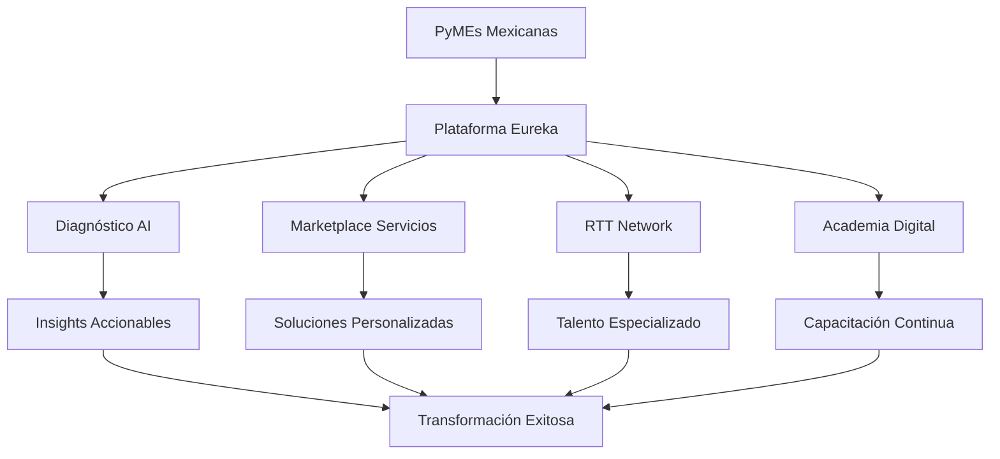

# 🎯 Visión General del Proyecto

## Resumen Ejecutivo

El Microfrontend de Servicios y Productos de Eureka es una plataforma revolucionaria que democratiza el acceso a consultoría empresarial de clase mundial mediante inteligencia artificial. Diseñada específicamente para PyMEs mexicanas, la plataforma ofrece una experiencia dual única: AI-First para usuarios tech-savvy y modo tradicional para aquellos menos familiarizados con la tecnología.

## 🌟 Visión

> "Transformar la manera en que las PyMEs mexicanas acceden a soluciones de transformación digital, haciendo que la consultoría de élite sea accesible, asequible y verdaderamente transformadora para todos."

## 🎯 Misión

Proporcionar una plataforma inteligente que actúe como un "Líder Digital Virtual" disponible 24/7, capaz de:

1. **Diagnosticar** el estado de madurez digital en tiempo real
2. **Recomendar** estrategias personalizadas basadas en miles de casos de éxito
3. **Conectar** con recursos temporales de transición (RTT) ideales
4. **Guiar** la transformación mediante mentoría AI personalizada
5. **Predecir** y prevenir obstáculos en proyectos de transformación

## 🔑 Propuesta de Valor Única

### Para Empresas con Experiencia en AI
- Asistente CDO virtual (ARIA) con capacidades avanzadas
- Personalización extrema basada en comportamiento
- Simuladores predictivos con gemelos digitales
- Automatización inteligente de procesos

### Para Empresas Tradicionales
- Interfaz familiar tipo formularios y menús
- Soporte humano disponible
- Transición gradual hacia funciones AI
- Documentación y guías paso a paso

## 📊 Contexto de Mercado

### Problema
- **68%** de PyMEs mexicanas enfrentan obstáculos para digitalización
- Escasez de talento especializado en transformación digital
- Presupuestos limitados para consultoría tradicional
- Resistencia cultural al cambio tecnológico

### Oportunidad
- Mercado de **$15-20 mil millones MXN** en servicios de consultoría
- Solo **41.7%** de empresas mexicanas han avanzado en digitalización
- Crecimiento del **25%** anual en demanda de transformación digital
- Impulso por nearshoring requiere modernización urgente

## 🎨 Principios de Diseño

### 1. AI-First pero Inclusivo
- La IA es el núcleo, no un añadido
- Opciones para todos los niveles de madurez digital
- Transición suave entre modos

### 2. Centrado en Resultados
- Métricas claras de ROI
- Garantías de satisfacción
- Impacto medible en el negocio

### 3. Simplicidad Inteligente
- Complejidad oculta tras interfaces simples
- Zero-friction onboarding
- Experiencias contextuales

### 4. Ético y Transparente
- Uso claro y responsable de datos
- Explicabilidad de decisiones AI
- Control total del usuario

## 🚀 Objetivos Estratégicos

### Corto Plazo (6 meses)
- [ ] Lanzar MVP con 100 empresas piloto
- [ ] Validar modelo dual AI/Tradicional
- [ ] Establecer 50 RTT verificados
- [ ] Lograr NPS > 70

### Mediano Plazo (12 meses)
- [ ] Escalar a 1,000+ usuarios activos
- [ ] Expandir a 3 ciudades principales
- [ ] Lanzar academia de certificación
- [ ] Alcanzar break-even operativo

### Largo Plazo (24 meses)
- [ ] Líder en transformación digital para PyMEs
- [ ] 10,000+ empresas transformadas
- [ ] Expansión internacional (LATAM)
- [ ] Exit estratégico o IPO

## 🌐 Ecosistema de Valor

## 📈 Modelo de Impacto

### Para las Empresas
- **25-35%** reducción en costos operativos
- **40-60%** mejora en eficiencia de procesos
- **2-3x** ROI en 12 meses
- **85%** tasa de adopción digital

### Para el Ecosistema
- Creación de **5,000+** empleos especializados
- Desarrollo de **500+** consultores certificados
- Contribución al PIB digital de México
- Posicionamiento en economía del conocimiento

## 🎪 Diferenciadores Clave

1. **Único con Modo Dual**: AI avanzada + interfaz tradicional
2. **Garantía de Resultados**: Modelo con riesgo compartido
3. **Transferencia de Conocimiento**: No creamos dependencia
4. **Contexto Local**: Diseñado para realidad mexicana
5. **Escalabilidad Infinita**: Tecnología que crece con demanda

## 📝 Casos de Uso Principales

### 1. Empresa Familiar en Transición
- Digitalización respetando cultura organizacional
- Puente generacional con tecnología
- Profesionalización sin perder identidad

### 2. PyME Proveedora Bajo Presión
- Cumplimiento rápido de estándares corporativos
- Integración con cadenas de suministro digitales
- Certificaciones express con AI

### 3. Startup en Crecimiento
- Escalamiento sin perder agilidad
- Automatización inteligente de procesos
- Análisis predictivo para decisiones

## 🔮 Visión a Futuro

En 5 años, toda empresa mexicana tendrá acceso a:
- Un Chief Digital Officer virtual o humano
- Transformación digital democratizada
- Ecosistema de innovación accesible
- Competitividad global desde lo local

---

**Siguiente**: [Arquitectura del Sistema →](./02-system-architecture.md)