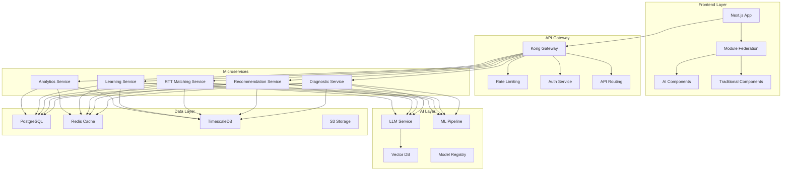
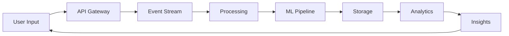

# 🏗️ Arquitectura del Sistema

## Visión General de la Arquitectura

La arquitectura del Microfrontend Eureka está diseñada para ser escalable, resiliente y adaptable, siguiendo principios de arquitectura moderna cloud-native con un enfoque AI-First.

## 🎨 Principios Arquitectónicos

### 1. Microservicios y Microfrontends
- Desacoplamiento de servicios para escalabilidad independiente
- Module Federation para microfrontends
- Comunicación asíncrona entre servicios

### 2. AI-First Architecture
- Integración nativa de modelos de IA
- Pipeline de ML/AI incorporado
- Edge computing para procesamiento local

### 3. Event-Driven Design
- Arquitectura basada en eventos
- Event sourcing para auditoría
- CQRS para optimización de lecturas

### 4. Security by Design
- Zero Trust Architecture
- Encriptación end-to-end
- Compliance GDPR/CCPA nativo

## 📐 Diagrama de Alto Nivel



## 🔧 Stack Tecnológico Detallado

### Frontend
```yaml
framework:
  main: Next.js 14
  routing: App Router
  rendering: SSR/SSG/ISR hybrid

ui:
  components: Shadcn/ui
  styling: Tailwind CSS
  animations: Framer Motion
  icons: Lucide React

state:
  global: Zustand
  server: React Query
  forms: React Hook Form
  validation: Zod

ai_integration:
  sdk: Vercel AI SDK
  streaming: Server-Sent Events
  voice: Web Speech API
  vision: TensorFlow.js

performance:
  bundler: Turbopack
  images: Next/Image with blur
  fonts: Variable fonts
  monitoring: Web Vitals
```

### Backend Services
```yaml
runtime:
  primary: Node.js + Bun
  secondary: Python (AI/ML)
  
api:
  rest: Express/Fastify
  graphql: Apollo Server
  realtime: Socket.io
  
database:
  primary: PostgreSQL 15
  cache: Redis 7
  vector: Pinecone
  timeseries: TimescaleDB
  
messaging:
  broker: Apache Kafka
  queue: Bull MQ
  pubsub: Redis Pub/Sub
  
storage:
  objects: AWS S3
  cdn: CloudFront
  temp: Redis
```

### AI/ML Infrastructure
```yaml
llm_providers:
  primary: OpenAI GPT-4
  secondary: Claude 3
  fallback: Gemini Pro
  
ml_framework:
  training: PyTorch
  serving: TorchServe
  edge: TensorFlow.js
  
vector_search:
  database: Pinecone
  embeddings: OpenAI Ada
  indexing: HNSW
  
mlops:
  versioning: DVC
  registry: MLflow
  monitoring: Weights & Biases
  deployment: Kubeflow
```

## 🔐 Arquitectura de Seguridad

### Capas de Seguridad
```typescript
interface SecurityArchitecture {
  // Capa de Red
  network: {
    firewall: 'AWS WAF',
    ddos: 'CloudFlare',
    vpn: 'WireGuard',
    tls: 'v1.3 minimum'
  },
  
  // Capa de Aplicación
  application: {
    authentication: 'JWT + Refresh',
    authorization: 'RBAC + ABAC',
    sessionManagement: 'Redis Sessions',
    csrf: 'Double Submit Cookie'
  },
  
  // Capa de Datos
  data: {
    encryption: 'AES-256-GCM',
    masking: 'Dynamic Data Masking',
    backup: 'Encrypted Snapshots',
    retention: 'Policy-based'
  },
  
  // Capa de IA
  ai: {
    modelSecurity: 'Secure Enclaves',
    privacyPreserving: 'Federated Learning',
    biasDetection: 'Continuous Monitoring',
    explainability: 'LIME/SHAP'
  }
}
```

## 🚀 Patrones de Escalabilidad

### Horizontal Scaling
```yaml
compute:
  orchestration: Kubernetes
  autoscaling: HPA + VPA
  loadbalancing: NGINX
  service_mesh: Istio

database:
  sharding: Vitess
  read_replicas: 3 regions
  connection_pooling: PgBouncer
  caching: Multi-tier

ai_services:
  model_serving: TorchServe clusters
  batch_processing: Ray
  gpu_scheduling: NVIDIA GPU Operator
  edge_inference: WebAssembly
```

### Estrategias de Cache
```typescript
const cacheStrategy = {
  // Cache Distribuido
  distributed: {
    provider: 'Redis Cluster',
    ttl: {
      userProfile: '1h',
      recommendations: '15m',
      staticContent: '24h'
    },
    invalidation: 'Tag-based'
  },
  
  // Edge Cache
  edge: {
    provider: 'CloudFlare Workers',
    locations: ['US', 'MX', 'BR'],
    rules: 'Geolocation-based'
  },
  
  // Browser Cache
  client: {
    strategy: 'Cache-first',
    storage: 'IndexedDB + LocalStorage',
    sync: 'Background Sync API'
  }
}
```

## 📊 Arquitectura de Datos

### Flujo de Datos


### Modelo de Datos
```sql
-- Ejemplo de esquema principal
CREATE TABLE organizations (
    id UUID PRIMARY KEY,
    name VARCHAR(255) NOT NULL,
    industry VARCHAR(100),
    size VARCHAR(50),
    maturity_score JSONB,
    created_at TIMESTAMP DEFAULT NOW(),
    metadata JSONB
);

CREATE TABLE diagnostics (
    id UUID PRIMARY KEY,
    org_id UUID REFERENCES organizations(id),
    type VARCHAR(50),
    results JSONB,
    ai_insights JSONB,
    created_at TIMESTAMP DEFAULT NOW()
);

CREATE TABLE services (
    id UUID PRIMARY KEY,
    name VARCHAR(255),
    category VARCHAR(100),
    pricing JSONB,
    ai_tags TEXT[],
    embedding VECTOR(1536)
);
```

## 🔄 Patrones de Integración

### API Gateway Pattern
```typescript
interface APIGatewayConfig {
  routing: {
    rules: 'Path-based + Header-based',
    versioning: 'URL + Header',
    discovery: 'Consul'
  },
  
  security: {
    authentication: 'OAuth2 + API Keys',
    rateLimit: 'Token Bucket',
    cors: 'Whitelist-based'
  },
  
  features: {
    transformation: 'Request/Response',
    aggregation: 'GraphQL Gateway',
    caching: 'Response Cache'
  }
}
```

## 📈 Monitoreo y Observabilidad

### Stack de Observabilidad
```yaml
metrics:
  collection: Prometheus
  visualization: Grafana
  alerting: AlertManager

logging:
  aggregation: ELK Stack
  structured: JSON
  correlation: TraceID

tracing:
  distributed: Jaeger
  apm: DataDog
  profiling: Continuous

monitoring:
  synthetic: Pingdom
  real_user: Google Analytics
  error_tracking: Sentry
```

## 🌐 Arquitectura Multi-Región

### Distribución Global
```typescript
const multiRegionArchitecture = {
  regions: {
    primary: 'us-east-1',
    secondary: ['us-west-2', 'sa-east-1'],
    edge: '150+ locations'
  },
  
  dataReplication: {
    strategy: 'Active-Active',
    consistency: 'Eventually Consistent',
    conflictResolution: 'CRDT'
  },
  
  routing: {
    dns: 'GeoDNS',
    loadBalancer: 'Global Accelerator',
    failover: 'Automatic with health checks'
  }
}
```

## 🔧 DevOps y CI/CD

### Pipeline de Deployment
```yaml
ci_cd:
  vcs: GitHub
  ci: GitHub Actions
  cd: ArgoCD
  
  stages:
    - build: Docker multi-stage
    - test: Unit + Integration + E2E
    - security: SAST + DAST + Dependencies
    - deploy: Blue-Green deployment
    
  environments:
    dev: Auto-deploy on merge
    staging: Manual approval
    production: Canary deployment
    
  rollback:
    strategy: Instant rollback
    automation: Health check based
```

---

**Anterior**: [← Visión General](./01-vision-overview.md) | **Siguiente**: [Experiencia de Usuario →](./03-user-experience.md)