# 🎨 Experiencia de Usuario

## Filosofía de Diseño UX

La experiencia de usuario en Eureka se basa en el principio de **"Simplicidad Inteligente"**: hacer que las capacidades más avanzadas de IA sean accesibles para todos, sin importar su nivel técnico.

## 🎭 Experiencia Dual: AI vs Tradicional

### Selector de Modo Inicial

```typescript
interface ModeSelection {
  // Primera impresión
  welcome: {
    headline: "¿Cómo prefieres trabajar?",
    subtitle: "Puedes cambiar en cualquier momento",
    options: [
      {
        mode: "ai-powered",
        title: "Experiencia Inteligente",
        description: "Conversaciones naturales con IA",
        icon: "🤖",
        recommended: true
      },
      {
        mode: "traditional",
        title: "Experiencia Clásica",
        description: "Formularios y menús familiares",
        icon: "📋"
      }
    ]
  }
}
```

### Comparación de Experiencias

| Característica | Modo AI | Modo Tradicional |
|----------------|---------|------------------|
| **Onboarding** | Conversacional | Formularios paso a paso |
| **Navegación** | Predictiva y contextual | Menús jerárquicos |
| **Búsqueda** | Lenguaje natural | Palabras clave |
| **Soporte** | Asistente AI 24/7 | Chat humano + FAQs |
| **Reportes** | Generados dinámicamente | Plantillas predefinidas |
| **Personalización** | Automática y continua | Configuración manual |

## 🚀 Flujos de Usuario Principales

### 1. Onboarding Journey

```mermaid
graph LR
    A[Landing] --> B{Selección Modo}
    B -->|AI| C[Chat Onboarding]
    B -->|Tradicional| D[Wizard Steps]
    
    C --> E[Diagnóstico Conversacional]
    D --> F[Formulario Diagnóstico]
    
    E --> G[Dashboard Personalizado]
    F --> G
    
    G --> H[Primera Acción Recomendada]
```



### 2. Diagnóstico Empresarial

#### Modo AI
```typescript
const aiDiagnosticFlow = {
  step1: {
    type: "conversation",
    prompt: "Hola, soy ARIA. Cuéntame sobre tu empresa",
    inputs: ["voice", "text", "file-upload"],
    duration: "5-10 min"
  },
  
  step2: {
    type: "smart-questions",
    adaptation: "based-on-previous-answers",
    complexity: "auto-adjusted"
  },
  
  step3: {
    type: "instant-results",
    format: "interactive-dashboard",
    insights: "ai-generated"
  }
}
```

#### Modo Tradicional
```typescript
const traditionalDiagnosticFlow = {
  step1: {
    type: "form",
    sections: ["Datos Básicos", "Industria", "Tamaño"],
    validation: "inline",
    progress: "visible"
  },
  
  step2: {
    type: "questionnaire",
    questions: "fixed-set",
    navigation: "back-next-buttons"
  },
  
  step3: {
    type: "static-report",
    format: "pdf-downloadable",
    delivery: "email"
  }
}
```

## 📱 Diseño Responsive y Adaptativo

### Breakpoints y Layouts
```scss
// Sistema de diseño responsive
$breakpoints: (
  mobile: 320px,
  tablet: 768px,
  desktop: 1024px,
  wide: 1440px
);

// Layouts adaptativos
.dashboard {
  @include mobile {
    grid-template-columns: 1fr;
    padding: 16px;
  }
  
  @include tablet {
    grid-template-columns: repeat(2, 1fr);
    padding: 24px;
  }
  
  @include desktop {
    grid-template-columns: repeat(3, 1fr);
    padding: 32px;
  }
}
```

### Componentes Adaptativos
```jsx
const AdaptiveCard = ({ mode, content }) => {
  if (mode === 'ai') {
    return (
      <motion.div
        initial={{ opacity: 0, y: 20 }}
        animate={{ opacity: 1, y: 0 }}
        className="ai-card"
      >
        <AIContentRenderer content={content} />
        <InteractiveActions />
      </motion.div>
    );
  }
  
  return (
    <div className="traditional-card">
      <CardHeader>{content.title}</CardHeader>
      <CardBody>{content.body}</CardBody>
      <CardFooter>
        <Button>Ver más</Button>
      </CardFooter>
    </div>
  );
};
```

## 🎨 Sistema de Diseño Visual

### Paleta de Colores
```typescript
const colorSystem = {
  // Colores principales
  primary: {
    ai: '#6366F1',      // Indigo vibrante
    traditional: '#3B82F6', // Azul confiable
    accent: '#8B5CF6'   // Púrpura innovador
  },
  
  // Semánticos
  semantic: {
    success: '#10B981',
    warning: '#F59E0B',
    error: '#EF4444',
    info: '#3B82F6'
  },
  
  // Neutrales
  neutral: {
    50: '#FAFAFA',
    100: '#F4F4F5',
    200: '#E4E4E7',
    300: '#D4D4D8',
    400: '#A1A1AA',
    500: '#71717A',
    600: '#52525B',
    700: '#3F3F46',
    800: '#27272A',
    900: '#18181B'
  }
};
```

### Tipografía
```css
/* Sistema tipográfico */
:root {
  --font-sans: 'Inter', system-ui, sans-serif;
  --font-mono: 'JetBrains Mono', monospace;
  
  /* Escala tipográfica */
  --text-xs: 0.75rem;    /* 12px */
  --text-sm: 0.875rem;   /* 14px */
  --text-base: 1rem;     /* 16px */
  --text-lg: 1.125rem;   /* 18px */
  --text-xl: 1.25rem;    /* 20px */
  --text-2xl: 1.5rem;    /* 24px */
  --text-3xl: 1.875rem;  /* 30px */
  --text-4xl: 2.25rem;   /* 36px */
}
```

## 🔄 Microinteracciones y Animaciones

### Principios de Animación
```typescript
const animationPrinciples = {
  // Duraciones
  duration: {
    instant: '100ms',
    fast: '200ms',
    normal: '300ms',
    slow: '500ms'
  },
  
  // Easing
  easing: {
    default: 'cubic-bezier(0.4, 0, 0.2, 1)',
    bounce: 'cubic-bezier(0.68, -0.55, 0.265, 1.55)',
    smooth: 'cubic-bezier(0.25, 0.1, 0.25, 1)'
  },
  
  // Tipos
  types: {
    entrance: 'fade + scale',
    exit: 'fade + translate',
    transition: 'smooth transform',
    feedback: 'subtle bounce'
  }
};
```

### Ejemplos de Microinteracciones
```jsx
// Botón con feedback háptico
const SmartButton = ({ children, onClick }) => {
  return (
    <motion.button
      whileHover={{ scale: 1.02 }}
      whileTap={{ scale: 0.98 }}
      onClick={(e) => {
        // Vibración sutil en móvil
        if ('vibrate' in navigator) {
          navigator.vibrate(10);
        }
        onClick(e);
      }}
      className="smart-button"
    >
      {children}
    </motion.button>
  );
};

// Loading con personalidad
const AIThinking = () => {
  return (
    <div className="ai-thinking">
      <motion.div
        animate={{
          scale: [1, 1.2, 1],
          opacity: [1, 0.5, 1]
        }}
        transition={{
          duration: 1.5,
          repeat: Infinity
        }}
      >
        <Brain className="w-6 h-6" />
      </motion.div>
      <span>ARIA está pensando...</span>
    </div>
  );
};
```

## 🌈 Accesibilidad y Diseño Inclusivo

### Estándares WCAG 2.2
```typescript
const accessibilityFeatures = {
  // Visual
  visual: {
    contrastRatio: 'AAA (7:1)',
    fontSize: 'Adjustable 12-24px',
    colorBlindMode: 'Deuteranopia, Protanopia, Tritanopia',
    darkMode: 'System preference + manual'
  },
  
  // Motor
  motor: {
    targetSize: 'Minimum 44x44px',
    keyboardNav: 'Full support',
    focusIndicators: 'High visibility',
    clickTimeout: 'Adjustable'
  },
  
  // Cognitivo
  cognitive: {
    language: 'Simple and clear',
    instructions: 'Step by step',
    errorRecovery: 'Forgiving',
    consistency: 'Predictable patterns'
  },
  
  // Auditivo
  auditory: {
    captions: 'Auto-generated',
    transcripts: 'Available',
    visualAlerts: 'Replace sounds'
  }
};
```

### Componentes Accesibles
```jsx
// Ejemplo de componente accesible
const AccessibleDialog = ({ isOpen, onClose, title, children }) => {
  return (
    <Dialog
      open={isOpen}
      onClose={onClose}
      aria-labelledby="dialog-title"
      aria-describedby="dialog-description"
    >
      <DialogTitle id="dialog-title">
        {title}
        <IconButton
          aria-label="Cerrar diálogo"
          onClick={onClose}
          className="ml-auto"
        >
          <X className="w-4 h-4" />
        </IconButton>
      </DialogTitle>
      
      <DialogContent id="dialog-description">
        {children}
      </DialogContent>
      
      <DialogActions>
        <Button onClick={onClose} variant="ghost">
          Cancelar
        </Button>
        <Button onClick={handleConfirm} autoFocus>
          Confirmar
        </Button>
      </DialogActions>
    </Dialog>
  );
};
```

## 📊 Dashboard Inteligente

### Layout Adaptativo
```typescript
interface DashboardLayout {
  aiMode: {
    widgets: [
      'AIAssistant',
      'PredictiveInsights',
      'SmartActions',
      'TrendAnalysis'
    ],
    layout: 'AI-optimized grid',
    personalization: 'Continuous learning'
  },
  
  traditionalMode: {
    widgets: [
      'MetricsTable',
      'TaskList',
      'ReportsSection',
      'NotificationsPanel'
    ],
    layout: 'Fixed grid',
    customization: 'Drag and drop'
  }
}
```

## 🔍 Patrones de Navegación

### AI-Powered Navigation
```jsx
const SmartNavigation = () => {
  const { predictions } = useNavigationAI();
  
  return (
    <nav className="smart-nav">
      <SearchCommand />
      <QuickActions items={predictions.quickActions} />
      <RecentlyVisited />
      <SuggestedNext items={predictions.nextSteps} />
    </nav>
  );
};
```

### Traditional Navigation
```jsx
const TraditionalNavigation = () => {
  return (
    <nav className="traditional-nav">
      <Logo />
      <MainMenu items={menuItems} />
      <Breadcrumb />
      <UserMenu />
    </nav>
  );
};
```

## 💬 Sistemas de Feedback

### Feedback Contextual
```typescript
const feedbackSystem = {
  // Éxito
  success: {
    visual: 'Green check animation',
    message: 'Clear success message',
    duration: '3 seconds',
    dismissible: true
  },
  
  // Error
  error: {
    visual: 'Red alert with icon',
    message: 'Helpful error explanation',
    actions: 'Suggested fixes',
    persistent: true
  },
  
  // Progreso
  progress: {
    visual: 'Linear or circular progress',
    message: 'Current action status',
    estimated: 'Time remaining',
    cancelable: true
  }
};
```

## 🎯 Métricas de UX

### KPIs de Experiencia
```typescript
const uxMetrics = {
  usability: {
    taskSuccessRate: '>90%',
    timeToComplete: '<3 min average',
    errorRate: '<5%',
    learnability: '1 session to proficiency'
  },
  
  satisfaction: {
    nps: '>70',
    sus: '>80',
    ces: '<2 (low effort)',
    csat: '>4.5/5'
  },
  
  engagement: {
    dailyActiveUsers: '>60%',
    sessionDuration: '>15 min',
    featureAdoption: '>70%',
    returnRate: '>80% weekly'
  }
};
```

---

**Anterior**: [← Arquitectura del Sistema](./02-system-architecture.md) | **Siguiente**: [Funcionalidades Core →](./04-core-features.md)