# 🚀 Funcionalidades Core

## Visión General de Funcionalidades

Las funcionalidades core de Eureka están diseñadas para proporcionar una experiencia completa de transformación digital, desde el diagnóstico inicial hasta la implementación y seguimiento continuo.

## 🤖 1. ARIA - Asistente de Transformación Digital

### Descripción
ARIA (Artificial Resource for Intelligent Adaptation) es el primer Chief Digital Officer virtual, capaz de guiar a las empresas en su viaje de transformación.

### Capacidades Principales

```typescript
interface ARIACapabilities {
  // Análisis Inteligente
  analysis: {
    businessDiagnostic: 'Evaluación profunda de madurez digital',
    competitiveAnalysis: 'Benchmarking con industria',
    gapIdentification: 'Detección de oportunidades',
    riskAssessment: 'Identificación de riesgos'
  },
  
  // Estrategia Personalizada
  strategy: {
    roadmapGeneration: 'Plan de transformación personalizado',
    prioritization: 'Ranking de iniciativas por ROI',
    resourcePlanning: 'Asignación óptima de recursos',
    timelineCreation: 'Cronograma realista'
  },
  
  // Ejecución Guiada
  execution: {
    projectMonitoring: 'Seguimiento en tiempo real',
    issueDetection: 'Alertas predictivas',
    solutionSuggestion: 'Recomendaciones contextuales',
    progressTracking: 'KPIs y métricas'
  },
  
  // Aprendizaje Continuo
  learning: {
    patternRecognition: 'Identificación de patrones de éxito',
    knowledgeTransfer: 'Documentación automática',
    teamTraining: 'Capacitación personalizada',
    bestPractices: 'Actualización continua'
  }
}
```

### Modos de Interacción

```jsx
const ARIAInteractionModes = () => {
  return (
    <div className="aria-modes">
      {/* Modo Conversacional */}
      <ConversationalMode>
        <VoiceInput />
        <NaturalLanguageChat />
        <ContextualResponses />
      </ConversationalMode>
      
      {/* Modo Visual */}
      <VisualMode>
        <InteractiveDashboards />
        <DataVisualization />
        <DragDropPlanning />
      </VisualMode>
      
      {/* Modo Colaborativo */}
      <CollaborativeMode>
        <TeamWorkspace />
        <SharedInsights />
        <RealTimeCollaboration />
      </CollaborativeMode>
    </div>
  );
};
```

## 📊 2. Diagnóstico Empresarial Inteligente

### Proceso de Diagnóstico

```mermaid
graph TD
    A[Inicio Diagnóstico] --> B{Modo Seleccionado}
    B -->|AI| C[Conversación Inteligente]
    B -->|Tradicional| D[Formulario Estructurado]
    
    C --> E[Análisis Automático]
    D --> F[Procesamiento Manual]
    
    E --> G[Insights AI]
    F --> H[Reporte Estándar]
    
    G --> I[Plan Personalizado]
    H --> J[Recomendaciones Genéricas]
```



### Componentes del Diagnóstico

```typescript
interface DiagnosticComponents {
  // Recolección de Datos
  dataCollection: {
    methods: ['conversational', 'forms', 'document-analysis', 'api-integration'],
    sources: ['user-input', 'public-data', 'system-integration', 'historical-data'],
    validation: 'real-time with AI',
    duration: '5-30 minutes'
  },
  
  // Análisis Multidimensional
  analysis: {
    dimensions: [
      'technological-maturity',
      'process-efficiency',
      'team-capabilities',
      'market-position',
      'financial-health',
      'innovation-readiness'
    ],
    scoring: 'AI-weighted algorithm',
    benchmarking: 'industry-specific'
  },
  
  // Generación de Resultados
  results: {
    format: ['interactive-dashboard', 'executive-summary', 'detailed-report'],
    insights: 'AI-generated with explanations',
    recommendations: 'prioritized-action-items',
    roadmap: 'customized-transformation-plan'
  }
}
```

### Visualización de Resultados

```jsx
const DiagnosticResults = ({ data }) => {
  return (
    <div className="diagnostic-results">
      {/* Radar de Madurez */}
      <MaturityRadar 
        dimensions={data.dimensions}
        scores={data.scores}
        benchmark={data.industryAverage}
      />
      
      {/* Mapa de Calor de Oportunidades */}
      <OpportunityHeatmap
        opportunities={data.opportunities}
        impact={data.impactAnalysis}
        effort={data.effortEstimation}
      />
      
      {/* Timeline de Transformación */}
      <TransformationTimeline
        phases={data.roadmap.phases}
        milestones={data.roadmap.milestones}
        quickWins={data.roadmap.quickWins}
      />
    </div>
  );
};
```

## 🛍️ 3. Marketplace de Servicios Inteligente

### Características del Marketplace

```typescript
interface SmartMarketplace {
  // Catálogo Dinámico
  catalog: {
    services: Service[],
    categorization: 'AI-powered tagging',
    presentation: 'personalized-ordering',
    pricing: 'dynamic-based-on-context'
  },
  
  // Búsqueda Inteligente
  search: {
    naturalLanguage: 'Tell me what you need',
    visualSearch: 'Upload screenshot of problem',
    voiceSearch: 'Explain your challenge',
    semanticMatching: 'Intent-based results'
  },
  
  // Recomendaciones
  recommendations: {
    algorithm: 'Collaborative + Content filtering',
    personalization: 'Based on diagnostic results',
    bundling: 'Smart service packages',
    timing: 'Optimal implementation sequence'
  },
  
  // Comparación
  comparison: {
    features: 'Side-by-side analysis',
    pricing: 'TCO calculator',
    reviews: 'Verified customer feedback',
    fitScore: 'AI compatibility rating'
  }
}
```

### Flujo de Compra Optimizado

```jsx
const PurchaseFlow = () => {
  const steps = [
    {
      name: 'Discovery',
      aiMode: <AIServiceMatcher />,
      traditionalMode: <CategoryBrowser />
    },
    {
      name: 'Evaluation',
      aiMode: <AIComparison />,
      traditionalMode: <FeatureTable />
    },
    {
      name: 'Configuration',
      aiMode: <SmartConfigurator />,
      traditionalMode: <ManualOptions />
    },
    {
      name: 'Purchase',
      aiMode: <OneClickBuy />,
      traditionalMode: <CheckoutForm />
    }
  ];
  
  return <AdaptiveFlow steps={steps} />;
};
```

## 👥 4. Red de RTT (Recursos Temporales de Transición)

### Sistema de Matching Inteligente

```python
class RTTMatchingEngine:
    def __init__(self):
        self.skill_embeddings = self.load_skill_embeddings()
        self.culture_analyzer = CultureFitAnalyzer()
        self.availability_tracker = AvailabilityTracker()
    
    def find_perfect_match(self, requirements):
        # Análisis de requerimientos
        skill_match = self.match_skills(requirements.skills)
        culture_fit = self.culture_analyzer.analyze(requirements.culture)
        availability = self.availability_tracker.check(requirements.timeline)
        
        # Scoring multidimensional
        candidates = self.score_candidates(
            skill_weight=0.4,
            culture_weight=0.3,
            availability_weight=0.2,
            cost_weight=0.1
        )
        
        # Ranking con explicación
        return self.rank_with_explanation(candidates)
```

### Portal de Talento

```typescript
interface TalentPortal {
  // Perfiles Enriquecidos
  profiles: {
    verification: 'Blockchain-verified credentials',
    showcase: 'Portfolio + Video intro',
    ratings: '360° feedback system',
    specializations: 'AI-tagged expertise'
  },
  
  // Colaboración
  collaboration: {
    workspace: 'Virtual project rooms',
    communication: 'Integrated chat/video',
    tracking: 'Time + Deliverables',
    knowledge: 'Automatic documentation'
  },
  
  // Gestión
  management: {
    contracts: 'Smart contracts',
    payments: 'Automated milestones',
    performance: 'Real-time metrics',
    succession: 'Knowledge transfer'
  }
}
```

## 🎓 5. Academia Personalizada AI-Powered

### Sistema de Aprendizaje Adaptativo

```typescript
interface AdaptiveLearning {
  // Evaluación Inicial
  assessment: {
    skillGapAnalysis: 'AI-powered testing',
    learningStyleIdentification: 'Multimodal assessment',
    goalSetting: 'Personalized objectives',
    timeCommitment: 'Flexible scheduling'
  },
  
  // Rutas Personalizadas
  learningPaths: {
    generation: 'AI-curated content',
    adaptation: 'Real-time adjustments',
    formats: ['video', 'interactive', 'text', 'AR/VR'],
    pacing: 'Individual speed'
  },
  
  // Contenido Inteligente
  content: {
    creation: 'AI-generated examples',
    localization: 'Mexican context',
    difficulty: 'Dynamic adjustment',
    relevance: 'Job-specific scenarios'
  },
  
  // Certificación
  certification: {
    evaluation: 'Competency-based',
    verification: 'Blockchain certificates',
    recognition: 'Industry partnerships',
    maintenance: 'Continuous updates'
  }
}
```

### Experiencia de Aprendizaje

```jsx
const LearningExperience = () => {
  return (
    <div className="academy">
      {/* Dashboard Personalizado */}
      <PersonalizedDashboard>
        <ProgressTracker />
        <NextLesson />
        <Achievements />
      </PersonalizedDashboard>
      
      {/* Contenido Interactivo */}
      <InteractiveContent>
        <VideoLessons withAITutor />
        <PracticeExercises withRealTimeHints />
        <VirtualLabs />
      </InteractiveContent>
      
      {/* Comunidad */}
      <LearningCommunity>
        <StudyGroups />
        <PeerDiscussions />
        <ExpertMentorship />
      </LearningCommunity>
    </div>
  );
};
```

## 📈 6. Analytics y Business Intelligence

### Dashboard de Insights

```typescript
interface IntelligentAnalytics {
  // Métricas en Tiempo Real
  realTimeMetrics: {
    kpis: 'Auto-selected based on goals',
    visualization: 'AI-optimized charts',
    alerts: 'Predictive anomaly detection',
    drill-down: 'Contextual exploration'
  },
  
  // Análisis Predictivo
  predictiveAnalytics: {
    forecasting: 'ML-based projections',
    scenarios: 'What-if simulations',
    recommendations: 'Action suggestions',
    confidence: 'Uncertainty quantification'
  },
  
  // Reportes Inteligentes
  reporting: {
    generation: 'Natural language queries',
    format: 'Auto-adapted to audience',
    insights: 'AI-discovered patterns',
    distribution: 'Smart scheduling'
  }
}
```

## 🔧 7. Automatización de Procesos

### Motor de Automatización

```python
class ProcessAutomation:
    def __init__(self):
        self.process_miner = ProcessMiningEngine()
        self.optimizer = ProcessOptimizer()
        self.automator = RoboticAutomation()
    
    def automate_process(self, process_id):
        # Descubrimiento de proceso
        current_flow = self.process_miner.discover(process_id)
        
        # Optimización con AI
        optimized_flow = self.optimizer.optimize(
            current_flow,
            constraints=['cost', 'time', 'quality']
        )
        
        # Implementación automática
        automation_plan = self.automator.create_plan(optimized_flow)
        
        # Monitoreo continuo
        return self.implement_with_monitoring(automation_plan)
```

## 🔐 8. Seguridad Inteligente

### Sistema de Seguridad AI-Powered

```typescript
interface AISecuritySystem {
  // Detección de Amenazas
  threatDetection: {
    behavioral: 'User behavior analytics',
    anomaly: 'ML-based detection',
    predictive: 'Threat forecasting',
    response: 'Automated containment'
  },
  
  // Acceso Inteligente
  accessControl: {
    biometric: 'Multi-factor with AI',
    contextual: 'Risk-based authentication',
    continuous: 'Session monitoring',
    adaptive: 'Dynamic permissions'
  },
  
  // Privacidad
  privacy: {
    dataMinimization: 'Smart collection',
    anonymization: 'AI-powered masking',
    consent: 'Granular management',
    compliance: 'Automated GDPR/CCPA'
  }
}
```

## 🌐 9. Integraciones Inteligentes

### Ecosistema de Integraciones


## 📱 10. Experiencia Mobile-First

### App Móvil Nativa

```typescript
interface MobileExperience {
  // Funcionalidades Offline
  offline: {
    dataSync: 'Smart conflict resolution',
    caching: 'Predictive content',
    forms: 'Queue for submission',
    analytics: 'Local processing'
  },
  
  // AI en el Edge
  edgeAI: {
    voiceCommands: 'On-device processing',
    imageRecognition: 'Document scanning',
    predictions: 'Lightweight models',
    personalization: 'Local adaptation'
  },
  
  // Notificaciones Inteligentes
  notifications: {
    timing: 'AI-optimized delivery',
    content: 'Personalized messages',
    actions: 'One-tap responses',
    priority: 'Smart filtering'
  }
}
```

---

**Anterior**: [← Experiencia de Usuario](./03-user-experience.md) | **Siguiente**: [Módulos del Sistema →](./05-system-modules.md)