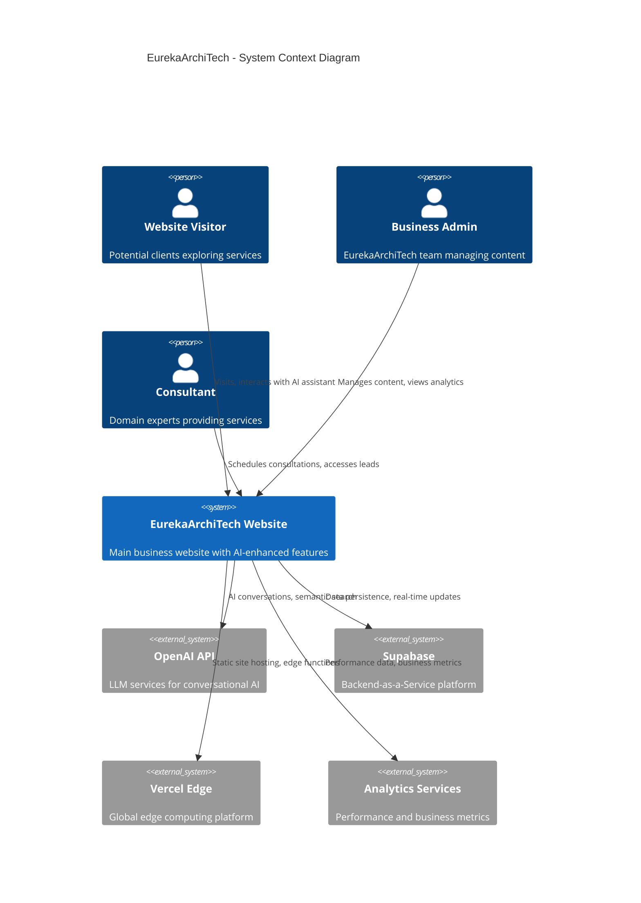
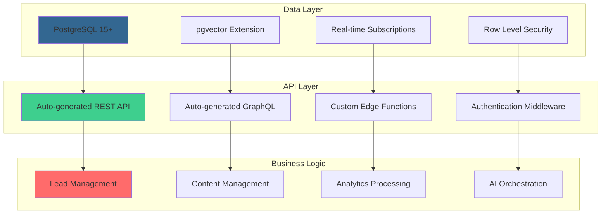
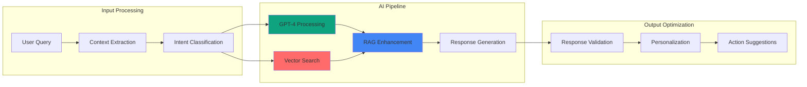
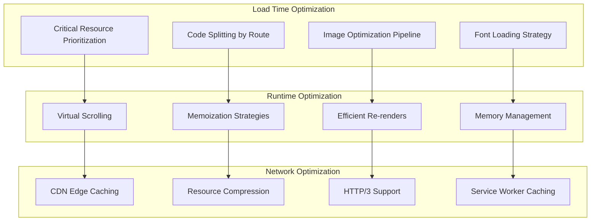
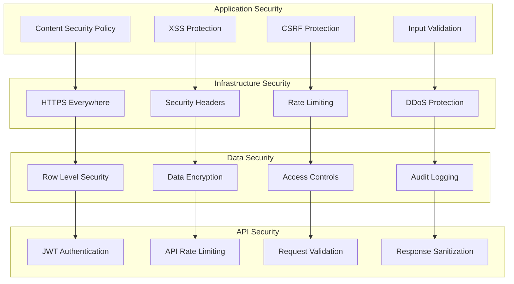
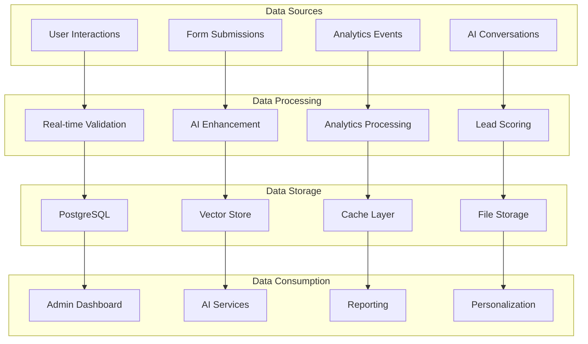
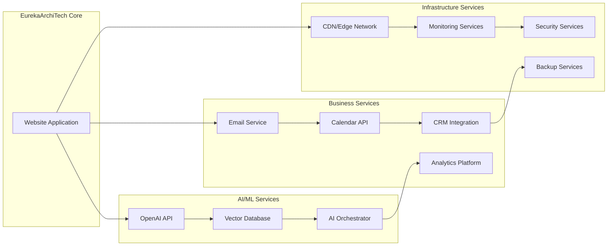
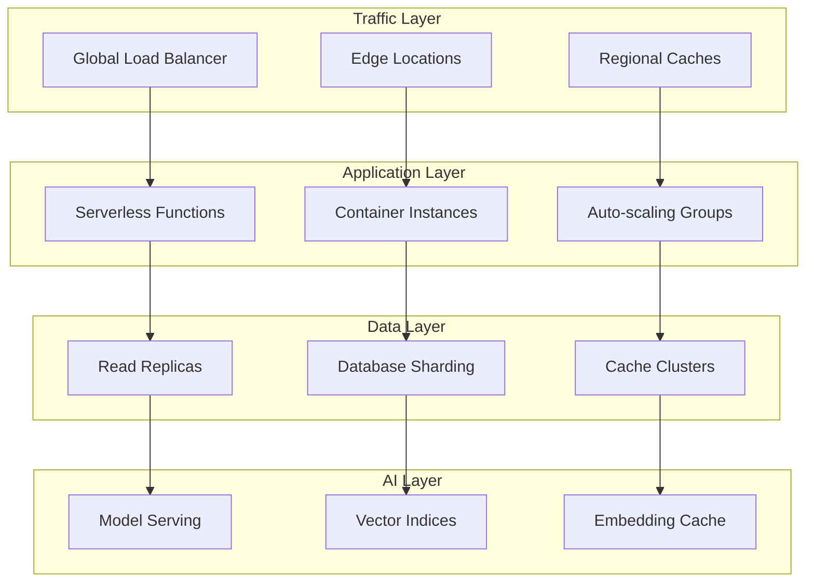
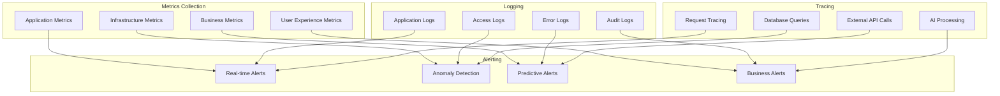

# EurekaArchiTech - Architecture Overview

## 📋 Executive Summary

Esta documentación describe la arquitectura técnica del sitio web oficial de EurekaArchiTech, diseñada siguiendo principios de **AI-First**, **Performance Excellence** y **Scalable Growth**. La arquitectura está optimizada para ofrecer una experiencia de usuario excepcional mientras mantiene la flexibilidad para evolucionar con las necesidades del negocio.

| Atributo | Valor |
|----------|-------|
| **Patrón Arquitectónico** | Islands Architecture + JAMstack |
| **Paradigma de Deployment** | Edge-first Serverless |
| **Estrategia de Datos** | API-first + Real-time |
| **Enfoque de Performance** | Performance Budget Driven |
| **Metodología de Desarrollo** | AI-Enhanced Development |

---

## 🏗️ Arquitectura de Alto Nivel



### Core Architectural Principles

#### 1. **Islands Architecture**
- **Static-first**: HTML estático para performance máximo
- **Selective Hydration**: JavaScript solo donde se necesita interactividad
- **Progressive Enhancement**: Funcionalidad base sin dependencias de JS

#### 2. **Edge-Native Design**
- **Global CDN**: Contenido distribuido mundialmente
- **Edge Functions**: Lógica computacional cerca del usuario
- **Zero Cold Starts**: Respuesta instantánea

#### 3. **AI-First Integration**
- **Conversational Interfaces**: ARIA assistant integrado
- **Semantic Search**: Búsqueda inteligente de contenido
- **Personalization**: Experiencias adaptadas por IA

---

## 🎯 System Architecture Diagram

```mermaid
C4Container
    title EurekaArchiTech - Container Diagram

    Container_Boundary(frontend, "Frontend Layer") {
        Container(astro, "Astro Framework", "Static Site Generator", "Generates optimized HTML/CSS/JS")
        Container(react_islands, "React Islands", "Interactive Components", "AI chat, forms, dynamic content")
        Container(pwa, "PWA Layer", "Progressive Web App", "Offline capability, app-like experience")
    }

    Container_Boundary(edge, "Edge Computing Layer") {
        Container(vercel_edge, "Vercel Edge Network", "Global CDN", "Static asset delivery")
        Container(edge_functions, "Edge Functions", "Serverless Runtime", "API endpoints, middleware")
        Container(edge_cache, "Edge Cache", "Distributed Caching", "Intelligent content caching")
    }

    Container_Boundary(backend, "Backend Services Layer") {
        Container(supabase_api, "Supabase API", "REST/GraphQL", "Auto-generated APIs")
        Container(postgresql, "PostgreSQL", "Database", "User data, content, analytics")
        Container(realtime, "Realtime Engine", "WebSocket Server", "Live updates, notifications")
        Container(auth, "Auth Service", "Authentication", "JWT-based authentication")
    }

    Container_Boundary(ai, "AI/ML Services Layer") {
        Container(openai_api, "OpenAI API", "Language Models", "GPT-4, embeddings")
        Container(vector_store, "Vector Database", "pgvector", "Semantic search, RAG")
        Container(ai_orchestrator, "AI Orchestrator", "Logic Layer", "AI workflow management")
    }

    Container_Boundary(external, "External Integrations") {
        Container(email, "Email Service", "Transactional Email", "User communications")
        Container(analytics_svc, "Analytics", "Data Collection", "User behavior, performance")
        Container(monitoring, "Monitoring", "Observability", "Error tracking, performance")
    }

    Rel(astro, vercel_edge, "Deploys static assets")
    Rel(react_islands, edge_functions, "API calls")
    Rel(edge_functions, supabase_api, "Database operations")
    Rel(supabase_api, postgresql, "Data queries")
    Rel(ai_orchestrator, openai_api, "LLM requests")
    Rel(ai_orchestrator, vector_store, "Semantic search")
    Rel(edge_functions, email, "Send notifications")
    Rel(frontend, analytics_svc, "Track events")
```

---

## 🔧 Technical Stack Deep Dive

### Frontend Layer

```typescript
interface FrontendArchitecture {
  core: {
    framework: "Astro 4.16+";
    architecture: "Islands";
    language: "TypeScript";
    bundler: "Vite + Rollup";
  };
  styling: {
    framework: "Tailwind CSS";
    methodology: "Utility-first + Design Tokens";
    responsive: "Mobile-first";
    themes: "CSS Custom Properties";
  };
  interactivity: {
    islands: "React 18";
    state: "Zustand (minimal)";
    forms: "React Hook Form";
    validation: "Zod";
  };
  performance: {
    bundle_target: "<5KB critical JS";
    image_optimization: "Astro Image + WebP";
    font_loading: "Font Display Swap";
    critical_css: "Inline above-fold";
  };
}
```

#### Islands Implementation Strategy

```typescript
// Example: AI Chat Island
export interface ChatIslandProps {
  initialContext?: string;
  userIntent?: 'consultation' | 'information' | 'support';
  theme?: 'default' | 'minimal';
}

// Only loads when user interacts
const ChatIsland = lazy(() => import('./ChatIsland'));

// Astro component usage
---
<ChatIsland 
  client:visible 
  initialContext="service inquiry"
  userIntent="consultation"
/>
---
```

### Backend Architecture



#### Database Schema Design

```sql
-- Core entities with relationships
CREATE TABLE profiles (
    id UUID REFERENCES auth.users PRIMARY KEY,
    metadata JSONB,
    created_at TIMESTAMPTZ DEFAULT NOW()
);

CREATE TABLE leads (
    id UUID PRIMARY KEY DEFAULT gen_random_uuid(),
    profile_id UUID REFERENCES profiles(id),
    lead_data JSONB NOT NULL,
    ai_analysis JSONB,
    created_at TIMESTAMPTZ DEFAULT NOW()
);

CREATE TABLE content_embeddings (
    id UUID PRIMARY KEY DEFAULT gen_random_uuid(),
    content_id TEXT NOT NULL,
    embedding vector(1536),
    metadata JSONB,
    created_at TIMESTAMPTZ DEFAULT NOW()
);

-- Indexes for performance
CREATE INDEX idx_embeddings_vector ON content_embeddings 
USING ivfflat (embedding vector_cosine_ops) WITH (lists = 100);
```

### AI/ML Architecture



#### AI Service Implementation

```typescript
interface AIService {
  chat: {
    model: "gpt-4-turbo";
    max_tokens: 1000;
    temperature: 0.7;
    system_prompt: string;
  };
  embeddings: {
    model: "text-embedding-3-large";
    dimensions: 1536;
    chunk_size: 800;
    overlap: 200;
  };
  vector_search: {
    similarity_threshold: 0.8;
    max_results: 5;
    rerank: true;
  };
  personalization: {
    user_context: boolean;
    behavioral_signals: boolean;
    intent_prediction: boolean;
  };
}
```

---

## 🚀 Performance Architecture

### Performance Budget

```typescript
interface PerformanceBudget {
  metrics: {
    first_contentful_paint: "< 1.2s";
    largest_contentful_paint: "< 1.5s";
    first_input_delay: "< 100ms";
    cumulative_layout_shift: "< 0.1";
    time_to_interactive: "< 2.5s";
  };
  resources: {
    total_javascript: "< 50KB";
    critical_javascript: "< 5KB";
    total_css: "< 20KB";
    critical_css: "< 8KB";
    images_per_page: "< 500KB";
  };
  lighthouse_targets: {
    performance: "> 95";
    accessibility: "= 100";
    best_practices: "= 100";
    seo: "= 100";
  };
}
```

### Optimization Strategies



#### Implementation Examples

```typescript
// Critical CSS inlining
export function inlineCriticalCSS() {
  return `
    <style>
      /* Above-the-fold styles */
      body { font-family: Inter, sans-serif; margin: 0; }
      .hero { min-height: 100vh; display: flex; align-items: center; }
      /* ... */
    </style>
  `;
}

// Image optimization configuration
export const imageConfig = {
  formats: ['webp', 'avif', 'png'],
  sizes: [640, 768, 1024, 1280, 1920],
  quality: 85,
  loading: 'lazy',
  decoding: 'async',
};

// Code splitting strategy
const routes = {
  '/': () => import('./pages/Home'),
  '/servicios': () => import('./pages/Services'),
  '/nosotros': () => import('./pages/About'),
  '/contacto': () => import('./pages/Contact'),
};
```

---

## 🔐 Security Architecture

### Security Layers



#### Security Configuration

```typescript
// Content Security Policy
const csp = {
  'default-src': ["'self'"],
  'script-src': ["'self'", "'unsafe-inline'", "https://vercel.live"],
  'style-src': ["'self'", "'unsafe-inline'", "https://fonts.googleapis.com"],
  'font-src': ["'self'", "https://fonts.gstatic.com"],
  'img-src': ["'self'", "data:", "https:"],
  'connect-src': ["'self'", "https://*.supabase.co", "https://api.openai.com"],
};

// Rate limiting configuration
const rateLimits = {
  general: { requests: 100, window: '1m' },
  auth: { requests: 5, window: '1m' },
  api: { requests: 60, window: '1m' },
  ai: { requests: 20, window: '1m' },
};

// Input validation schema
const leadSchema = z.object({
  email: z.string().email(),
  name: z.string().min(2).max(50),
  company: z.string().min(2).max(100),
  message: z.string().min(10).max(1000),
});
```

---

## 📊 Data Architecture

### Data Flow Diagram



#### Data Models

```typescript
// Core data structures
interface Lead {
  id: string;
  personal_info: PersonalInfo;
  company_info: CompanyInfo;
  inquiry_details: InquiryDetails;
  ai_analysis: AIAnalysis;
  lifecycle: LeadLifecycle;
  created_at: Date;
  updated_at: Date;
}

interface AIAnalysis {
  intent_classification: string;
  sentiment_score: number;
  urgency_level: 'low' | 'medium' | 'high';
  recommended_actions: string[];
  confidence_score: number;
}

interface ContentEmbedding {
  id: string;
  content_type: 'service' | 'case_study' | 'blog';
  text_content: string;
  embedding_vector: number[];
  metadata: Record<string, any>;
  last_updated: Date;
}
```

---

## 🔄 Integration Architecture

### External Services Integration



#### Integration Patterns

```typescript
// Service abstraction layer
interface ExternalService {
  name: string;
  baseUrl: string;
  authentication: AuthConfig;
  rateLimits: RateLimitConfig;
  retryPolicy: RetryConfig;
}

// OpenAI integration
const openAIService: ExternalService = {
  name: 'OpenAI',
  baseUrl: 'https://api.openai.com/v1',
  authentication: { type: 'bearer', token: process.env.OPENAI_API_KEY },
  rateLimits: { requests: 3000, window: '1m' },
  retryPolicy: { maxRetries: 3, backoffMs: 1000 },
};

// Error handling pattern
async function withRetry<T>(
  operation: () => Promise<T>,
  retryConfig: RetryConfig
): Promise<T> {
  // Implementation with exponential backoff
}
```

---

## 📈 Scalability Architecture

### Horizontal Scaling Strategy



#### Scaling Metrics & Triggers

```typescript
interface ScalingConfig {
  triggers: {
    cpu_utilization: 70; // percent
    memory_utilization: 80; // percent
    request_rate: 1000; // per minute
    response_time: 500; // milliseconds
  };
  scaling_policies: {
    scale_up: {
      cooldown: 300; // seconds
      step_size: 2; // instances
      max_instances: 20;
    };
    scale_down: {
      cooldown: 600; // seconds
      step_size: 1; // instances
      min_instances: 2;
    };
  };
  geographic_distribution: {
    primary_region: 'us-east-1';
    secondary_regions: ['us-west-2', 'eu-west-1'];
    latency_targets: {
      north_america: 50; // ms
      europe: 100; // ms
      asia: 150; // ms
    };
  };
}
```

---

## 🔍 Monitoring Architecture

### Observability Stack



#### Monitoring Configuration

```typescript
// Key metrics to track
const monitoringMetrics = {
  performance: {
    response_time: { threshold: 500, unit: 'ms' },
    throughput: { threshold: 1000, unit: 'req/min' },
    error_rate: { threshold: 1, unit: 'percent' },
    availability: { threshold: 99.9, unit: 'percent' },
  },
  business: {
    conversion_rate: { threshold: 5, unit: 'percent' },
    lead_generation: { threshold: 10, unit: 'leads/day' },
    user_engagement: { threshold: 180, unit: 'seconds' },
    page_views: { threshold: 1000, unit: 'views/day' },
  },
  infrastructure: {
    cpu_usage: { threshold: 80, unit: 'percent' },
    memory_usage: { threshold: 85, unit: 'percent' },
    disk_usage: { threshold: 90, unit: 'percent' },
    network_latency: { threshold: 100, unit: 'ms' },
  },
};

// Alert routing configuration
const alertRouting = {
  critical: ['slack://emergency', 'email://oncall', 'sms://lead'],
  warning: ['slack://alerts', 'email://team'],
  info: ['slack://monitoring'],
};
```

---

## 🚀 Future Architecture Roadmap

### Phase 1: Foundation (Complete)
- ✅ Basic website with AI chat
- ✅ Lead generation forms
- ✅ Performance optimization
- ✅ Security hardening

### Phase 2: Enhancement (Q1 2025)
- 🔄 Advanced AI personalization
- 🔄 Real-time collaboration features
- 🔄 Enhanced analytics dashboard
- 🔄 Multi-language support

### Phase 3: Scale (Q2 2025)
- 📅 Microservices architecture
- 📅 Advanced caching strategies
- 📅 Multi-region deployment
- 📅 Advanced AI features

### Phase 4: Innovation (Q3 2025)
- 📅 Edge AI processing
- 📅 Real-time personalization
- 📅 Advanced automation
- 📅 Predictive analytics

---

## 📞 Architecture Review & Support

### Architecture Decision Records (ADRs)

Todas las decisiones arquitectónicas importantes están documentadas en:
- `/docs/decisions/adr-001-ai-first-approach.md`
- `/docs/decisions/adr-002-islands-architecture.md`
- `/docs/decisions/adr-003-edge-deployment.md`

### Regular Architecture Reviews

| Frecuencia | Scope | Participantes |
|------------|-------|---------------|
| **Mensual** | Performance & Security | Tech Team |
| **Trimestral** | Feature Architecture | Tech + Product |
| **Semestral** | Strategic Architecture | Leadership + External |
| **Anual** | Complete Architecture Audit | All Stakeholders |

### Contact Information

- **Lead Architect**: oscar@eureka-architech.com
- **Architecture Team**: architecture@eureka-architech.com
- **Documentation**: https://docs.eureka-architech.com/architecture

---

*Última actualización: Enero 2025*  
*Versión: 1.0*  
*Próxima revisión: Abril 2025*  
*Mantenido por: EurekaArchiTech Architecture Team*